# Frontend System Design — Learning Roadmap

> 120 topics across 11 phases. Every completed topic is saved as a structured, diagram-rich `.md` note with an ELI5 explanation, real-world code, quiz questions (with answers), a cheat sheet and curated references.


**Legend:** ✅ note completed · ⬜ planned

---

## Table of Contents

- [Getting Started (Clone & Read)](#getting-started-clone--read)
- [Diagrams Not Showing? (Mermaid fix)](#diagrams-not-showing-mermaid-fix)
- [Learning Path](#learning-path)
- [Progress](#progress)
- [How Each Note Is Structured](#how-each-note-is-structured)
- [Roadmap](#phase-1--web-fundamentals) (Phases 1–11)
- [Suggested Resources](#suggested-resources)
- [Contributing / Adding a New Note](#adding-a-new-note)

---

## Getting Started (Clone & Read)

**1. Clone the project**

```bash
git clone https://github.com/Muzammil8989/frontend-system-design.git
cd frontend-system-design
code .          # opens the folder in VS Code
```

> No Git? Download the ZIP from the green **Code** button on GitHub and extract it.

**2. Open a note in VS Code and read it as a formatted page**

1. In the left sidebar open the [`notes/`](./notes) folder and click any `.md` file.
2. Press **`Ctrl + Shift + V`** (Mac: `Cmd + Shift + V`) → opens the **Markdown Preview** (formatted view with tables, headings, code blocks).
3. Press **`Ctrl + K`, then `V`** to open the preview **side-by-side** with the raw file.

> Tip: read the first note in order — [How Browsers Work](./notes/how-browsers-work.md) → [Critical Rendering Path](./notes/critical-rendering-path.md) → [Browser Storage Mechanisms](./notes/browser-storage-mechanisms.md) → [JavaScript Runtime & Event Loop](./notes/javascript-runtime-event-loop.md).

**3. Alternative: just read it on GitHub**

Open the repo on GitHub and click any note — tables, collapsible answers and diagrams all render there with **no setup**.

---

## Diagrams Not Showing? (Mermaid fix)

The notes use [Mermaid](https://mermaid.js.org/) for diagrams. GitHub renders them automatically, but **VS Code's built-in preview does not**, so you may see raw code like ` ```mermaid ` instead of a picture. Fix it in under a minute:

**Option 1 — Install the VS Code extension (recommended)**

1. Open Extensions: **`Ctrl + Shift + X`**
2. Search **`Markdown Preview Mermaid Support`** (publisher: *Matt Bierner*, id `bierner.markdown-mermaid`) → click **Install**
3. Re-open the preview with **`Ctrl + Shift + V`** — diagrams now appear.

Or install from a terminal:

```bash
code --install-extension bierner.markdown-mermaid
```

> When you open this project, VS Code will also suggest this extension automatically (see [`.vscode/extensions.json`](./.vscode/extensions.json)) — just click **Install**.

**Option 2 — Read on GitHub**

Diagrams work out of the box on github.com. Nothing to install.

**Option 3 — Paste into the online editor**

Copy the diagram code (without the ` ```mermaid ` lines) into [mermaid.live](https://mermaid.live) to view or export it as an image.

**Option 4 — Alternative extension**

[`Markdown Preview Enhanced`](https://marketplace.visualstudio.com/items?itemName=shd101wyy.markdown-preview-enhanced) (`shd101wyy.markdown-preview-enhanced`) also renders Mermaid. Open it via `Ctrl + Shift + P` → **Markdown Preview Enhanced: Open Preview to the Side**.

| Problem | Fix |
|---|---|
| Diagram shows as plain code | Install `Markdown Preview Mermaid Support` (Option 1) |
| Installed but still not showing | Reload VS Code: `Ctrl + Shift + P` → **Developer: Reload Window** |
| Answers hidden under "Answer" | Click the small ▶ arrow — they are collapsible on purpose |
| No internet / office PC blocks extensions | Use Option 2 (GitHub) or Option 3 (mermaid.live) |

---

## Learning Path

```mermaid
flowchart LR
    P1["1 · Web<br/>Fundamentals"] --> P2["2 · Rendering &<br/>Architecture"]
    P2 --> P3["3 · State<br/>& Data"]
    P3 --> P4["4 · Performance"]
    P4 --> P5["5 · Design Systems<br/>& Components"]
    P5 --> P6["6 · A11y<br/>& i18n"]
    P6 --> P7["7 · Security"]
    P7 --> P8["8 · Testing"]
    P8 --> P9["9 · Monitoring"]
    P9 --> P10["10 · Advanced"]
    P10 --> P11["11 · System<br/>Design Cases"]
    style P1 fill:#dcfce7,stroke:#16a34a
```



Phases 1–4 build the foundations; 5–9 are the engineering practices used in production; 10–11 combine everything into interview-style system design cases.

---

## Progress

| Phase | Done | Total |
|---|:---:|:---:|
| 1 · Web Fundamentals | 4 | 14 |
| 2 · Rendering & Architecture | 0 | 12 |
| 3 · State & Data | 0 | 12 |
| 4 · Performance Engineering | 0 | 15 |
| 5 · Design Systems & Components | 0 | 12 |
| 6 · Accessibility & i18n | 0 | 9 |
| 7 · Security | 0 | 8 |
| 8 · Testing | 0 | 8 |
| 9 · Monitoring & Observability | 0 | 7 |
| 10 · Advanced Topics | 0 | 8 |
| 11 · System Design Cases | 0 | 15 |
| **Total** | **4** | **120** |

---

## How Each Note Is Structured

Every note in [`notes/`](./notes) follows the same layout so they are quick to skim and easy to revise:

1. **ELI5** — the idea in plain language
2. **Core concept** — step-by-step, with Mermaid diagrams
3. **Real-world examples** — copy-pasteable code
4. **Key points summary** — one-liners
5. **Test your understanding** — questions with collapsible answers
6. **Cheat sheet** — definitions, quick reference, common mistakes
7. **References & further reading** — MDN, web.dev, specs, deep dives

> Diagrams are written in [Mermaid](https://mermaid.js.org/) and render automatically on GitHub (and in VS Code with a Mermaid preview extension).

---

## Phase 1 — Web Fundamentals

| # | Topic | Category |
|---|---|---|
| 1 | ✅ [How Browsers Work](./notes/how-browsers-work.md) | Browser Internals |
| 2 | ✅ [Critical Rendering Path](./notes/critical-rendering-path.md) | Browser Internals |
| 3 | ✅ [Browser Storage Mechanisms](./notes/browser-storage-mechanisms.md) | Browser Internals |
| 4 | ✅ [JavaScript Runtime & Event Loop](./notes/javascript-runtime-event-loop.md) | Browser Internals |
| 5 | ⬜ DOM & Virtual DOM | Browser Internals |
| 6 | ⬜ HTTP/1.1 vs HTTP/2 vs HTTP/3 | Networking |
| 7 | ⬜ DNS Resolution & CDN | Networking |
| 8 | ⬜ TCP/TLS Handshake | Networking |
| 9 | ⬜ REST vs GraphQL vs gRPC-Web | Networking |
| 10 | ⬜ WebSockets & SSE & Long Polling | Networking |
| 11 | ⬜ CORS & Same-Origin Policy | Networking |
| 12 | ⬜ Service Workers & Web Workers | Browser APIs |
| 13 | ⬜ Web APIs (Intersection Observer, ResizeObserver) | Browser APIs |
| 14 | ⬜ Browser Caching Strategies | Caching |

---

## Phase 2 — Rendering & Architecture

| # | Topic | Category |
|---|---|---|
| 15 | ⬜ Client-Side Rendering (CSR) | Rendering Patterns |
| 16 | ⬜ Server-Side Rendering (SSR) | Rendering Patterns |
| 17 | ⬜ Static Site Generation (SSG) | Rendering Patterns |
| 18 | ⬜ Incremental Static Regeneration (ISR) | Rendering Patterns |
| 19 | ⬜ Streaming SSR & React Server Components | Rendering Patterns |
| 20 | ⬜ Island Architecture | Rendering Patterns |
| 21 | ⬜ Edge Rendering | Rendering Patterns |
| 22 | ⬜ Micro-Frontends Architecture | Architecture |
| 23 | ⬜ Mono-repo vs Multi-repo | Architecture |
| 24 | ⬜ Component Architecture & Design Systems | Architecture |
| 25 | ⬜ Feature-Sliced Design | Architecture |
| 26 | ⬜ Module Bundling & Build Systems | Build Tools |

---

## Phase 3 — State & Data

| # | Topic | Category |
|---|---|---|
| 27 | ⬜ Client State Management Patterns | State Management |
| 28 | ⬜ Redux & Redux Toolkit | State Management |
| 29 | ⬜ Zustand / Jotai / Recoil | State Management |
| 30 | ⬜ Server State vs Client State | State Management |
| 31 | ⬜ React Query / TanStack Query | Data Fetching |
| 32 | ⬜ SWR & Stale-While-Revalidate | Data Fetching |
| 33 | ⬜ GraphQL Client (Apollo, urql) | Data Fetching |
| 34 | ⬜ Data Normalization & Caching | Data Fetching |
| 35 | ⬜ Optimistic UI Updates | Data Fetching |
| 36 | ⬜ Pagination & Infinite Scroll | Data Fetching |
| 37 | ⬜ Real-Time Data Sync | Data Fetching |
| 38 | ⬜ Offline-First Architecture | Data Fetching |

---

## Phase 4 — Performance Engineering

| # | Topic | Category |
|---|---|---|
| 39 | ⬜ Core Web Vitals (LCP, FID, CLS, INP) | Performance Metrics |
| 40 | ⬜ Lighthouse & Performance Auditing | Performance Metrics |
| 41 | ⬜ Performance Budgets | Performance Metrics |
| 42 | ⬜ Code Splitting & Lazy Loading | Loading Performance |
| 43 | ⬜ Tree Shaking & Dead Code Elimination | Loading Performance |
| 44 | ⬜ Image Optimization | Loading Performance |
| 45 | ⬜ Font Loading Strategies | Loading Performance |
| 46 | ⬜ Prefetching & Preloading | Loading Performance |
| 47 | ⬜ JavaScript Bundle Optimization | Loading Performance |
| 48 | ⬜ Virtual Scrolling & Windowing | Runtime Performance |
| 49 | ⬜ React Performance (memo, useMemo, useCallback) | Runtime Performance |
| 50 | ⬜ Debouncing & Throttling | Runtime Performance |
| 51 | ⬜ Web Workers for Heavy Computation | Runtime Performance |
| 52 | ⬜ Memory Leaks in Frontend Apps | Runtime Performance |
| 53 | ⬜ Animation Performance (CSS vs JS) | Runtime Performance |

---

## Phase 5 — Design Systems & Components

| # | Topic | Category |
|---|---|---|
| 54 | ⬜ Atomic Design Methodology | Design System |
| 55 | ⬜ Design Tokens | Design System |
| 56 | ⬜ Component API Design | Design System |
| 57 | ⬜ Compound Component Pattern | Component Patterns |
| 58 | ⬜ Headless UI / Renderless Components | Component Patterns |
| 59 | ⬜ Controlled vs Uncontrolled Components | Component Patterns |
| 60 | ⬜ Higher-Order Components & Render Props | Component Patterns |
| 61 | ⬜ Custom Hooks Patterns | Component Patterns |
| 62 | ⬜ Storybook & Component Documentation | Design System |
| 63 | ⬜ CSS Architecture (CSS-in-JS, Tailwind, CSS Modules) | Styling |
| 64 | ⬜ Responsive Design Patterns | Styling |
| 65 | ⬜ Theming & Dark Mode | Styling |

---

## Phase 6 — Accessibility & i18n

| # | Topic | Category |
|---|---|---|
| 66 | ⬜ ARIA Roles, States & Properties | Accessibility |
| 67 | ⬜ Keyboard Navigation & Focus Management | Accessibility |
| 68 | ⬜ Screen Reader Testing | Accessibility |
| 69 | ⬜ Color Contrast & Visual Accessibility | Accessibility |
| 70 | ⬜ Accessible Forms & Error Handling | Accessibility |
| 71 | ⬜ Automated A11y Testing (axe, Lighthouse) | Accessibility |
| 72 | ⬜ Internationalization (i18n) Architecture | Internationalization |
| 73 | ⬜ RTL Layout Support | Internationalization |
| 74 | ⬜ Date, Number & Currency Formatting | Internationalization |

---

## Phase 7 — Security

| # | Topic | Category |
|---|---|---|
| 75 | ⬜ XSS Prevention (Reflected, Stored, DOM) | Frontend Security |
| 76 | ⬜ Content Security Policy (CSP) | Frontend Security |
| 77 | ⬜ CSRF Protection | Frontend Security |
| 78 | ⬜ Authentication Flows in SPAs | Frontend Security |
| 79 | ⬜ Secure Token Storage | Frontend Security |
| 80 | ⬜ Subresource Integrity (SRI) | Frontend Security |
| 81 | ⬜ Clickjacking & iframe Protection | Frontend Security |
| 82 | ⬜ Dependency Vulnerability Scanning | Frontend Security |

---

## Phase 8 — Testing

| # | Topic | Category |
|---|---|---|
| 83 | ⬜ Unit Testing Components (Jest, Vitest) | Testing |
| 84 | ⬜ React Testing Library Patterns | Testing |
| 85 | ⬜ Integration Testing | Testing |
| 86 | ⬜ E2E Testing (Playwright, Cypress) | Testing |
| 87 | ⬜ Visual Regression Testing | Testing |
| 88 | ⬜ Performance Testing | Testing |
| 89 | ⬜ Accessibility Testing | Testing |
| 90 | ⬜ Testing Strategies & Pyramid | Testing |

---

## Phase 9 — Monitoring & Observability

| # | Topic | Category |
|---|---|---|
| 91 | ⬜ Error Boundaries & Global Error Handling | Error Handling |
| 92 | ⬜ Error Tracking (Sentry, Datadog RUM) | Error Handling |
| 93 | ⬜ Real User Monitoring (RUM) | Monitoring |
| 94 | ⬜ Synthetic Monitoring | Monitoring |
| 95 | ⬜ Feature Flags & A/B Testing | Analytics |
| 96 | ⬜ Analytics Architecture | Analytics |
| 97 | ⬜ Logging Best Practices | Monitoring |

---

## Phase 10 — Advanced Topics

| # | Topic | Category |
|---|---|---|
| 98 | ⬜ Progressive Web Apps (PWA) | Advanced |
| 99 | ⬜ WebAssembly (WASM) in Frontend | Advanced |
| 100 | ⬜ Web Components & Shadow DOM | Advanced |
| 101 | ⬜ Authentication Architecture (BFF Pattern) | Advanced |
| 102 | ⬜ SEO for SPAs & Dynamic Content | Advanced |
| 103 | ⬜ Deployment & CI/CD for Frontend | Advanced |
| 104 | ⬜ CDN Architecture & Edge Caching | Advanced |
| 105 | ⬜ Monorepo Tooling (Turborepo, Nx) | Advanced |

---

## Phase 11 — System Design Cases

| # | Topic | Category |
|---|---|---|
| 106 | ⬜ Design a News Feed (Facebook/Twitter) | Social |
| 107 | ⬜ Design an Autocomplete / Typeahead | Search |
| 108 | ⬜ Design an Image Carousel / Gallery | Media |
| 109 | ⬜ Design a Chat Application UI | Messaging |
| 110 | ⬜ Design a Spreadsheet (Google Sheets) | Productivity |
| 111 | ⬜ Design a Video Player (YouTube) | Media |
| 112 | ⬜ Design a Drag-and-Drop Board (Trello) | Productivity |
| 113 | ⬜ Design a Rich Text Editor | Productivity |
| 114 | ⬜ Design an E-Commerce Product Page | E-Commerce |
| 115 | ⬜ Design a Dashboard with Real-Time Data | Analytics |
| 116 | ⬜ Design a Multi-Step Form / Wizard | Forms |
| 117 | ⬜ Design a Notification System UI | Notification |
| 118 | ⬜ Design a Map-Based Application | Geo |
| 119 | ⬜ Design a Calendar Component | Productivity |
| 120 | ⬜ Design a Design Tool (Figma-like Canvas) | Advanced |

---

## Suggested Resources

| Resource | Why |
|---|---|
| [MDN Web Docs](https://developer.mozilla.org/) | Authoritative reference for HTML, CSS, JS and Web APIs |
| [web.dev](https://web.dev/) | Performance, Core Web Vitals, PWA and accessibility guides |
| [Chrome for Developers](https://developer.chrome.com/) | Browser internals, DevTools, new platform features |
| [WHATWG HTML Standard](https://html.spec.whatwg.org/) | The actual spec behind parsing, scripting and the event loop |
| [patterns.dev](https://www.patterns.dev/) | Rendering, design and performance patterns |
| [GreatFrontEnd](https://www.greatfrontend.com/) | Frontend interview and system design practice |
| [Frontend Masters](https://frontendmasters.com/) | In-depth video courses |
| [W3C WAI](https://www.w3.org/WAI/) | Accessibility standards (WCAG, ARIA) |
| [OWASP Cheat Sheet Series](https://cheatsheetseries.owasp.org/) | Practical web security guidance |

---

## Adding a New Note

1. Copy [`notes/_TEMPLATE.md`](./notes/_TEMPLATE.md) to `notes/<topic-slug>.md` (lower-case, hyphenated).
2. Fill every section — diagrams, code, quiz with answers, cheat sheet, references.
3. Verify all links open and Mermaid diagrams render in the GitHub preview.
4. Flip the topic's ⬜ to ✅ and link it in the roadmap above.
5. Update the **Progress** table and the badge at the top.
6. Commit with a conventional message, e.g. `feat(notes): add <Topic> note`.

---
