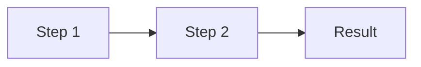
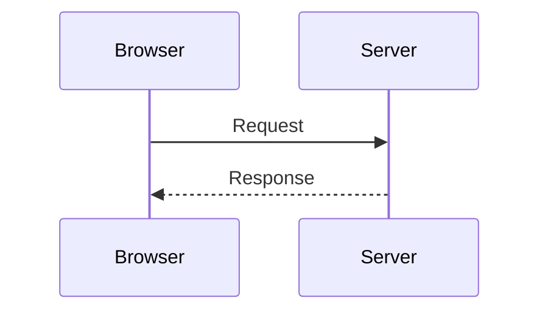

# <Topic Title>

> **Date:** YYYY-MM-DD · **Last updated:** YYYY-MM-DD
> **Category:** Frontend System Design
> **Sub-Topic:** <e.g. Browser Internals / Networking / Performance>
> **Level:** Beginner | Intermediate | Advanced · **Reading time:** ~N min

> **Pre-requisite:** [Previous Topic](./previous-topic.md)

**Previous:** [Previous Topic](./previous-topic.md) · **Next:** [Next Topic](./next-topic.md)

---

## Table of Contents

1. [ELI5 — Simple Explanation](#eli5--simple-explanation)
2. [Core Concept](#core-concept--step-by-step)
3. [Real-World Examples](#real-world-examples)
4. [Key Points Summary](#key-points-summary)
5. [Test Your Understanding](#test-your-understanding)
6. [Cheat Sheet](#cheat-sheet)
7. [References & Further Reading](#references--further-reading)

---

## ELI5 — Simple Explanation

<A real-life analogy a beginner understands in 30 seconds.>

> **One-line takeaway.**

---

## Core Concept — Step by Step

### Section 1: <Name>

<Explanation. Prefer a diagram over a paragraph.>





| Term | Meaning |
|---|---|
| **X** | … |

---

## Real-World Examples

**Example 1 — <Title>:**
```javascript
// BAD
// GOOD
```

---

## Key Points Summary

| Concept | One-Line Explanation |
|---|---|
| **X** | … |

---

## Test Your Understanding

**Q1 (Basic):** …

<details>
<summary>Answer</summary>

…
</details>

**Q2 (Application):** …

<details>
<summary>Answer</summary>

…
</details>

**Q3 (Tricky):** …

<details>
<summary>Answer</summary>

…
</details>

---

## Cheat Sheet

**Key Definitions:**
- **X:** …

**Quick Reference:**
```
…
```

**Common Mistakes to Avoid:**

| Mistake | Why Wrong | Fix |
|---|---|---|
| … | … | … |

---

## References & Further Reading

**Core docs**
- MDN: [Title](https://developer.mozilla.org/)
- web.dev: [Title](https://web.dev/)

**Specs**
- [Spec / RFC](https://example.com)

**Deep dives**
- [Article / talk](https://example.com)

---

> **Previous Topic:** [Previous](./previous-topic.md)
> **Next Topic:** [Next](./next-topic.md)

*Saved on: YYYY-MM-DD | Repo: Frontend System Design Learning Notes*
