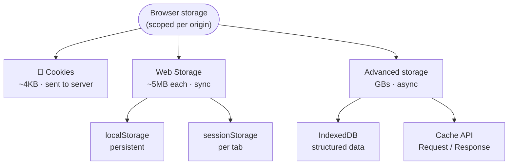
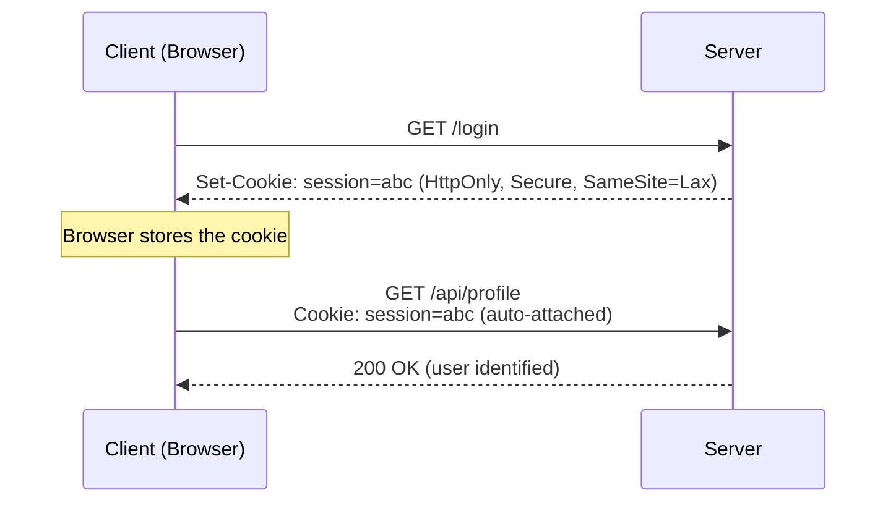
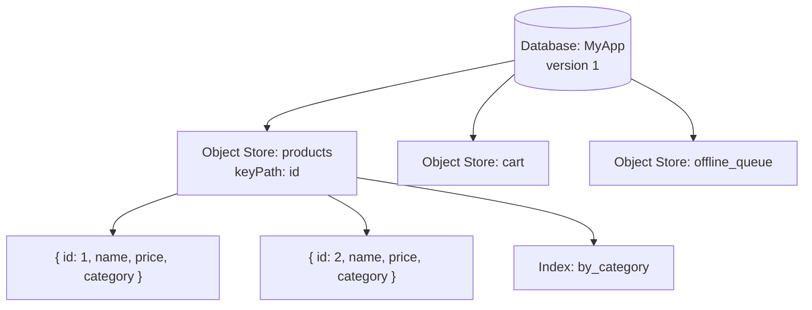
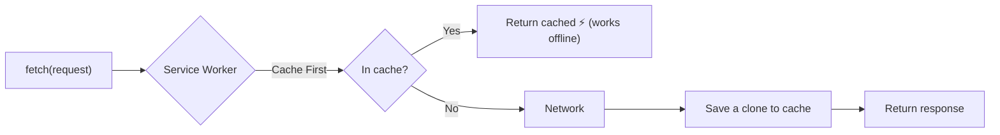
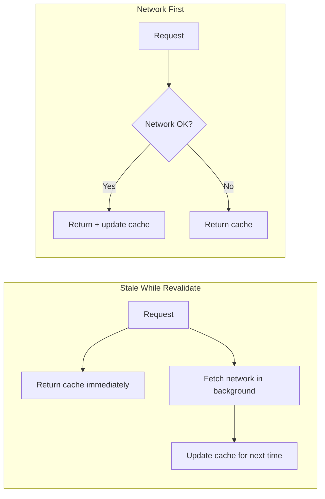
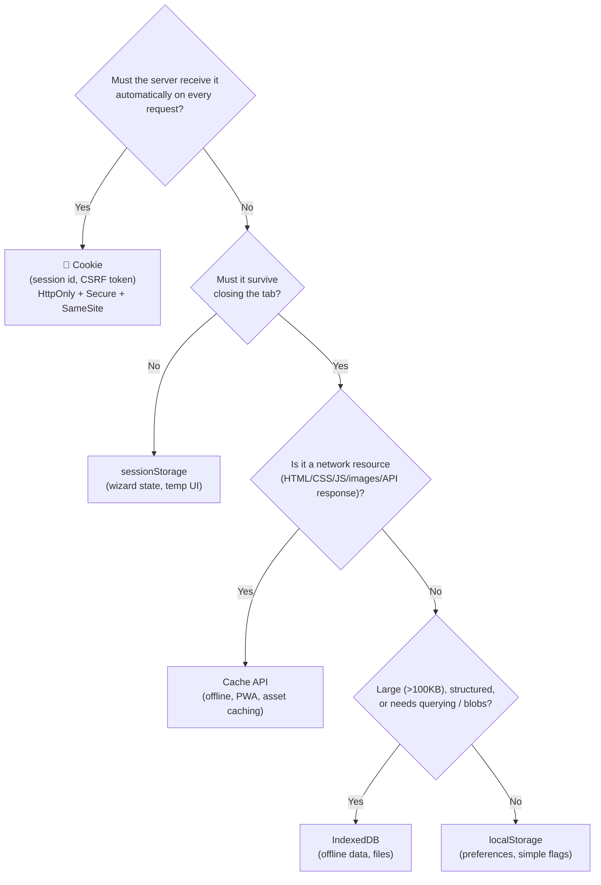
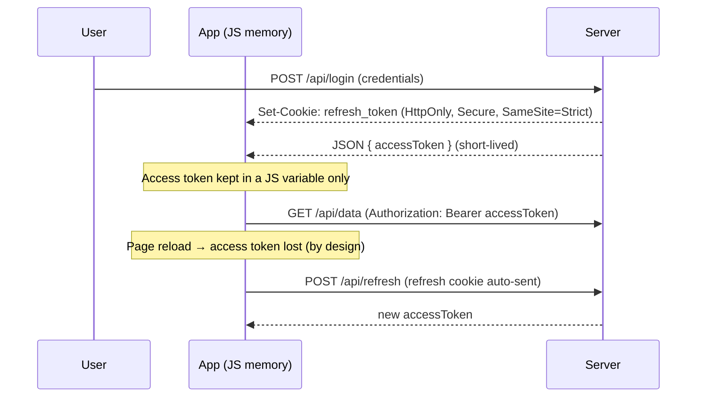

# Browser Storage Mechanisms

> **Date:** 2026-03-27 · **Last updated:** 2026-10-08
> **Category:** Frontend System Design
> **Sub-Topic:** Browser Internals / Storage
> **Level:** Intermediate · **Reading time:** ~20 min

> **Pre-requisite:** Read [How Browsers Work](./how-browsers-work.md) first.
> This note covers where and how browsers store data — on the client side.

**Previous:** [Critical Rendering Path](./critical-rendering-path.md) · **Next:** [JavaScript Runtime & Event Loop](./javascript-runtime-event-loop.md)

---

## Table of Contents

1. [ELI5 — Simple Explanation](#eli5--simple-explanation)
2. [Section 1: The Storage Landscape](#section-1-the-storage-landscape)
3. [Section 2: Cookies](#section-2-cookies)
4. [Section 3: localStorage](#section-3-localstorage)
5. [Section 4: sessionStorage](#section-4-sessionstorage)
6. [Section 5: IndexedDB](#section-5-indexeddb)
7. [Section 6: Cache API](#section-6-cache-api)
8. [Section 7: Quotas, Eviction & Privacy](#section-7-quotas-eviction--privacy)
9. [Section 8: Cross-Tab Communication](#section-8-cross-tab-communication)
10. [Storage Decision Tree](#full-visual--storage-decision-tree)
11. [Real-World Examples](#real-world-examples)
12. [Key Points Summary](#key-points-summary)
13. [Test Your Understanding (with answers)](#test-your-understanding)
14. [Cheat Sheet](#cheat-sheet)
15. [References & Further Reading](#references--further-reading)

---

## ELI5 — Simple Explanation

Imagine your browser is a desk at work:
- **Cookie** = a sticky note on your monitor — small, seen by everyone, expires
- **localStorage** = your desk drawer — stays there even after you leave for the day
- **sessionStorage** = a notepad you tear up when you go home — gone when tab closes
- **IndexedDB** = a filing cabinet — holds thousands of files, searchable, structured
- **Cache API** = a shelf of saved documents so you don't reprint the same thing twice

> **Each storage type exists for a different reason.**
> Picking the wrong one causes security bugs, data loss, or poor performance.

---

## Core Concept — Step by Step

### Section 1: The Storage Landscape

There are 5 client-side storage mechanisms you need to know:



```
┌─────────────────────────────────────────────────────────┐
│                  BROWSER STORAGE                        │
│                                                         │
│  ┌──────────┐  ┌──────────────┐  ┌───────────────────┐  │
│  │  Cookie  │  │  Web Storage │  │  Advanced Storage  │  │
│  │          │  │              │  │                   │  │
│  │ ~4KB     │  │ localStorage │  │ IndexedDB (GBs)   │  │
│  │ sent to  │  │ sessionStr.  │  │ Cache API         │  │
│  │ server   │  │ ~5–10MB each │  │ (Service Worker)  │  │
│  └──────────┘  └──────────────┘  └───────────────────┘  │
└─────────────────────────────────────────────────────────┘
```

| Storage | Max Size | Survives Tab Close | Survives Browser Restart | Sent to Server | API style | Available in Workers |
|---|---|---|---|---|---|---|
| **Cookie** | ~4KB each | ✅ Yes | ⚠️ Only if `Max-Age`/`Expires` set (session cookies may be cleared) | ✅ **Always** (matching requests) | Sync (string) | ❌ (use Cookie Store API in SW) |
| **localStorage** | ~5–10MB | ✅ Yes | ✅ Yes | ❌ No | Sync | ❌ No |
| **sessionStorage** | ~5–10MB | ❌ No (survives reload) | ❌ No | ❌ No | Sync | ❌ No |
| **IndexedDB** | Quota-based (GBs) | ✅ Yes | ✅ Yes | ❌ No | Async | ✅ Yes |
| **Cache API** | Quota-based (GBs) | ✅ Yes | ✅ Yes | ❌ No | Async | ✅ Yes |

> **Origin isolation:** All of these are scoped to the **origin** (scheme + host + port). `http://a.com`, `https://a.com`, and `https://a.com:8080` each get separate storage (cookies are the exception: they are scoped by domain + path and ignore port).

---

### Section 2: Cookies

Cookies are the oldest storage mechanism. Created by server or JavaScript, **automatically sent with every HTTP request** to the matching domain.



**Creating cookies — server vs client:**

```http
# Server sets cookie (HTTP response header)
Set-Cookie: session_id=abc123; HttpOnly; Secure; SameSite=Strict; Max-Age=3600; Path=/
```

```javascript
// Client sets cookie (JS) — cannot set HttpOnly from JS
document.cookie = "theme=dark; Max-Age=86400; SameSite=Lax; Secure";

// Reading cookies — ugly but real
const theme = document.cookie
  .split('; ')
  .find(c => c.startsWith('theme='))
  ?.split('=')[1];
```

**Cookie security flags — every one matters:**

| Flag | What it does | When to use |
|---|---|---|
| `HttpOnly` | JS cannot read this cookie | Auth tokens — prevents XSS theft |
| `Secure` | Only sent over HTTPS | Always in production |
| `SameSite=Strict` | Not sent on cross-site requests | CSRF protection — same site only |
| `SameSite=Lax` | Sent on top-level navigation (GET) only | Good default balance (browser default in modern browsers when unset) |
| `SameSite=None` | Sent everywhere | Requires `Secure`; for cross-site embeds |
| `Max-Age` / `Expires` | When cookie expires | Session vs persistent (Chrome caps lifetime at 400 days) |
| `Domain` | Which subdomains receive it | `Domain=example.com` = all subdomains |
| `Path` | Which URL paths receive it | `/api` = only API routes get it |
| `Partitioned` (CHIPS) | Cookie keyed by top-level site | Third-party embeds that need state without cross-site tracking |
| `__Host-` prefix | Forces `Secure`, `Path=/`, no `Domain` | Strongest scoping for session cookies |

> **Rule:** Auth tokens must be `HttpOnly` + `Secure` + `SameSite=Strict/Lax`.
> Never store auth tokens in localStorage — XSS can steal them.

**Performance side-effect:** every cookie for a domain is sent on **every** request to it (including images/CSS on that domain). Large cookies slow every request — keep them small, or serve static assets from a cookieless domain/CDN.

**Third-party cookies:** Safari and Firefox block them by default; Chrome's plans have changed repeatedly, so don't depend on them — design for partitioned or first-party state.

---

### Section 3: localStorage

Synchronous key-value store. Data persists until explicitly cleared. Shared across all tabs of the same origin.

```
Origin: https://myapp.com

Tab 1: localStorage.setItem('user', 'Alice')
Tab 2: localStorage.getItem('user')  → 'Alice'   ← same data!
```

```javascript
// WRITE
localStorage.setItem('theme', 'dark');
localStorage.setItem('prefs', JSON.stringify({ lang: 'en', fontSize: 16 }));

// READ
const theme = localStorage.getItem('theme');           // 'dark'
const prefs = JSON.parse(localStorage.getItem('prefs'));  // { lang: 'en', ... }

// DELETE
localStorage.removeItem('theme');

// CLEAR ALL
localStorage.clear();

// CHECK SIZE (approximate — counts characters, not bytes)
let total = 0;
for (const key of Object.keys(localStorage)) {
  total += localStorage.getItem(key).length + key.length;
}
console.log(`~${(total / 1024).toFixed(2)} KB used`);
```

**Defensive wrapper** — `setItem` can throw (quota exceeded, private mode, blocked storage):

```javascript
function safeSet(key, value) {
  try {
    localStorage.setItem(key, JSON.stringify(value));
    return true;
  } catch (err) {
    // QuotaExceededError, SecurityError (blocked), etc.
    console.warn('localStorage unavailable:', err.name);
    return false;
  }
}
```

**Important limitations:**
- Synchronous — blocks the main thread on large reads/writes
- Strings only — must `JSON.stringify` / `JSON.parse` objects
- No expiry — data never auto-deletes (store a timestamp and check it yourself)
- ~5–10MB limit (varies by browser)
- Not available in Web Workers or Service Workers
- Readable by **any** script on the page (including third-party scripts and XSS payloads)

```
Use localStorage for:
✅ User preferences (theme, language, font size)
✅ Non-sensitive cached data (last viewed item ID)
✅ Feature flag overrides (dev tools)

Never use for:
❌ Auth tokens (XSS risk)
❌ Large datasets (use IndexedDB)
❌ Sensitive personal data
```

---

### Section 4: sessionStorage

Identical API to localStorage but data lives only for the browser tab session. Each tab gets its own isolated sessionStorage.

```
Tab 1: sessionStorage.setItem('step', '2')
Tab 2: sessionStorage.getItem('step')  → null  ← isolated!

Tab 1 closes → data gone
Tab 1 refreshes → data STILL there (refresh ≠ close)
```

```javascript
// Same API as localStorage — just replace "localStorage" with "sessionStorage"
sessionStorage.setItem('checkout_step', '3');
sessionStorage.setItem('form_draft', JSON.stringify({ name: 'Alice', email: '...' }));

const step = sessionStorage.getItem('checkout_step');

// Auto-cleared when tab closes — no manual cleanup needed
```

**localStorage vs sessionStorage — when to use:**

```
localStorage    → data needed across tabs or sessions
                  (theme, cached user prefs, "dismissed banner" flags)

sessionStorage  → data scoped to this tab, this visit only
                  (multi-step form progress, wizard state,
                   shopping cart before login, temporary UI state)
```

> **Detail:** a tab opened via `window.open()`/link with `noopener` omitted gets a **copy** of the opener's sessionStorage at creation, after which they diverge. Duplicating a tab also copies it.

---

### Section 5: IndexedDB

A full **transactional NoSQL database** in the browser. Supports complex objects (anything structured-cloneable: objects, arrays, `Blob`, `File`, `Date`), indexes, cursors, and stores gigabytes of data. Asynchronous — never blocks the main thread. Works in Web Workers and Service Workers.



```
IndexedDB Structure:
┌─────────────────────────────────────┐
│         Database: "MyApp"           │
│                                     │
│  ┌──────────────────────────────┐   │
│  │  Object Store: "products"    │   │
│  │  ┌──────┬──────────────────┐ │   │
│  │  │  id  │      data        │ │   │
│  │  ├──────┼──────────────────┤ │   │
│  │  │  1   │ { name, price }  │ │   │
│  │  │  2   │ { name, price }  │ │   │
│  │  └──────┴──────────────────┘ │   │
│  │  Index: "by_category"        │   │
│  └──────────────────────────────┘   │
│                                     │
│  Object Store: "cart"               │
│  Object Store: "offline_queue"      │
└─────────────────────────────────────┘
```

**Raw IndexedDB API** (verbose — most devs use a wrapper library):

```javascript
// Open / create database
const request = indexedDB.open('MyApp', 1);

request.onupgradeneeded = (event) => {
  const db = event.target.result;
  // Create object store (like a table)
  const store = db.createObjectStore('products', { keyPath: 'id' });
  // Create an index for fast queries
  store.createIndex('by_category', 'category', { unique: false });
};

request.onsuccess = (event) => {
  const db = event.target.result;

  // WRITE (inside a transaction)
  const tx = db.transaction('products', 'readwrite');
  tx.objectStore('products').add({ id: 1, name: 'Laptop', price: 999, category: 'tech' });

  // READ by key
  const readTx = db.transaction('products', 'readonly');
  const getReq = readTx.objectStore('products').get(1);
  getReq.onsuccess = () => console.log(getReq.result); // { id: 1, name: 'Laptop', ... }
};
```

**Using [`idb`](https://github.com/jakearchibald/idb) (wrapper library — recommended):**

```javascript
import { openDB } from 'idb';

const db = await openDB('MyApp', 1, {
  upgrade(db) {
    const store = db.createObjectStore('products', { keyPath: 'id' });
    store.createIndex('by_category', 'category');
  }
});

// Write
await db.put('products', { id: 1, name: 'Laptop', price: 999, category: 'tech' });

// Read
const product = await db.get('products', 1);

// Query via index
const tech = await db.getAllFromIndex('products', 'by_category', 'tech');

// Get all
const all = await db.getAll('products');

// Delete
await db.delete('products', 1);
```

**Schema changes** happen only in `onupgradeneeded` / `upgrade()` — bump the version number whenever you change stores or indexes, and handle multiple tabs on different versions (`versionchange` / `blocked` events).

```
Use IndexedDB for:
✅ Offline-first apps (cache API responses)
✅ Large datasets (product catalogs, documents)
✅ Structured data needing querying/indexing
✅ Background sync queues
✅ File/blob storage (images, PDFs)

Overkill for:
❌ Simple key-value pairs → use localStorage
❌ Small preferences → use localStorage
```

---

### Section 6: Cache API

Part of the Service Worker ecosystem (also available from the page and workers). Stores **HTTP Request/Response pairs** — designed for caching network resources (HTML, CSS, JS, images, API responses). It is **not** the same as the browser's automatic HTTP cache, which is controlled by `Cache-Control` headers; the Cache API is fully programmatic.



```
Without Cache API:
Browser → Network → Server → Response → Display (online only)

With Cache API:
Browser → Cache? → Yes: use cached response (instant, offline)
                → No:  Network → Server → save to Cache → Display
```

```javascript
// In a Service Worker (sw.js)

// CACHE on install
self.addEventListener('install', (event) => {
  event.waitUntil(
    caches.open('v1').then((cache) =>
      cache.addAll([
        '/',
        '/styles.css',
        '/app.js',
        '/offline.html'
      ])
    )
  );
});

// SERVE from cache, fall back to network
self.addEventListener('fetch', (event) => {
  event.respondWith(
    caches.match(event.request).then((cached) =>
      cached ?? fetch(event.request)
    )
  );
});

// In regular JS — programmatic cache access
const cache = await caches.open('api-cache-v1');
await cache.put('/api/products', new Response(JSON.stringify(products)));
const cached = await cache.match('/api/products');
const data = await cached.json();
```

**Version your caches and clean up old ones** on `activate`, otherwise stale files stay forever:

```javascript
self.addEventListener('activate', (event) => {
  event.waitUntil(
    caches.keys().then((keys) =>
      Promise.all(keys.filter((k) => k !== 'v1').map((k) => caches.delete(k)))
    )
  );
});
```

**Caching strategies:**

| Strategy | Logic | Best for |
|---|---|---|
| **Cache First** | Serve cache, ignore network | Static assets (CSS, JS, fonts) |
| **Network First** | Try network, fall back to cache | API data needing freshness |
| **Stale While Revalidate** | Serve cache instantly, update in background | Feeds, non-critical data |
| **Cache Only** | Cache or fail | Offline-only assets |
| **Network Only** | Always network, no cache | Auth endpoints, payments |



> Don't hand-roll all of this in production — [Workbox](https://developer.chrome.com/docs/workbox) ships these strategies ready-made.

---

### Section 7: Quotas, Eviction & Privacy

Storage is **not guaranteed forever**.

- **Quota:** IndexedDB and Cache API share an origin quota (Chromium: a large fraction of free disk; Firefox and Safari use smaller, differing limits). Check with:
  ```javascript
  const { usage, quota } = await navigator.storage.estimate();
  console.log(`${(usage / 1e6).toFixed(1)} MB of ${(quota / 1e6).toFixed(0)} MB used`);
  ```
- **Eviction:** under storage pressure the browser may delete a whole origin's "best-effort" data. Ask for protection:
  ```javascript
  const persisted = await navigator.storage.persist(); // true if granted
  ```
- **Safari ITP:** Safari may delete script-writable storage (localStorage, IndexedDB, cookies set by JS) after ~7 days without user interaction with the site (installed home-screen web apps are exempt). Don't treat client storage as the only copy of important data — sync it to the server.
- **Private/incognito windows:** storage is wiped when the window closes; some older browsers throw errors on write.
- **Clearing site data** by the user removes everything for the origin.
- **Privacy/consent:** cookies (and often localStorage used for tracking) fall under GDPR / ePrivacy consent rules. Strictly necessary storage (session, cart, security) is typically exempt; analytics/ads are not.

**Other storage you may meet:**

| API | What it is |
|---|---|
| **Origin Private File System (OPFS)** | Fast, sandboxed file storage per origin; used by SQLite-in-WASM |
| **Cookie Store API** | Async cookie access (works in Service Workers) |
| **Storage Buckets** | Group data into buckets with separate eviction/priority |
| **Web SQL** | ❌ Deprecated and removed — do not use |

---

### Section 8: Cross-Tab Communication

localStorage changes fire a `storage` event in **other** tabs of the same origin — handy for "logout in all tabs":

```javascript
// Tab A
localStorage.setItem('logout', Date.now());

// Tab B (fires only in OTHER tabs, not the one that wrote)
window.addEventListener('storage', (e) => {
  if (e.key === 'logout') redirectToLogin();
});
```

For richer messaging use [`BroadcastChannel`](https://developer.mozilla.org/en-US/docs/Web/API/BroadcastChannel):

```javascript
const channel = new BroadcastChannel('app');
channel.postMessage({ type: 'LOGOUT' });
channel.onmessage = (e) => { if (e.data.type === 'LOGOUT') redirectToLogin(); };
```

---

## Full Visual — Storage Decision Tree



<details>
<summary>Same decision tree as plain-text</summary>

```
Do you need to send data to the server automatically?
  │
  ├── YES → Cookie
  │         (auth session, CSRF token)
  │
  └── NO → Does it need to survive tab close?
            │
            ├── NO → sessionStorage
            │        (form wizard, temp UI state)
            │
            └── YES → Is it a network resource (HTML/CSS/JS/images/API)?
                       │
                       ├── YES → Cache API
                       │         (offline support, PWA, asset caching)
                       │
                       └── NO → Is data large (>100KB) or complex/structured?
                                  │
                                  ├── YES → IndexedDB
                                  │         (offline data, large datasets, files)
                                  │
                                  └── NO → localStorage
                                            (preferences, simple flags)
```

</details>

---

## Real-World Examples

**Example 1 — Auth flow: correct storage per token type:**


```javascript
// ✅ Access token: short-lived, in memory only (not in any storage)
let accessToken = null;

async function login(credentials) {
  const res = await fetch('/api/login', {
    method: 'POST',
    headers: { 'Content-Type': 'application/json' },
    body: JSON.stringify(credentials)
  });
  // Server sets: Set-Cookie: refresh_token=...; HttpOnly; Secure; SameSite=Strict
  // We store access token only in memory — gone on refresh (by design)
  const { accessToken: token } = await res.json();
  accessToken = token;
}

// ✅ Refresh token: in HttpOnly cookie (auto-sent, JS can't read it)
// ✅ Theme preference: localStorage (safe, non-sensitive)
localStorage.setItem('theme', 'dark');

// ❌ WRONG: never do this
localStorage.setItem('access_token', token);  // XSS can steal it!
```

**Example 2 — Multi-step form: sessionStorage:**
```javascript
// Step 1 page: save progress
function saveStep1(formData) {
  sessionStorage.setItem('step1', JSON.stringify(formData));
  navigate('/checkout/step2');
}

// Step 2 page: restore if user goes back
function loadStep1() {
  const saved = sessionStorage.getItem('step1');
  return saved ? JSON.parse(saved) : null;
}

// Final submit: read all steps, clear storage
async function submitOrder() {
  const step1 = JSON.parse(sessionStorage.getItem('step1'));
  const step2 = JSON.parse(sessionStorage.getItem('step2'));
  await fetch('/api/order', { method: 'POST', body: JSON.stringify({ step1, step2 }) });
  sessionStorage.clear();  // clean up
}
```

**Example 3 — Offline product catalog: IndexedDB + Cache API:**
```javascript
// Service Worker: cache app shell
self.addEventListener('install', (e) => {
  e.waitUntil(caches.open('shell-v1').then(c => c.addAll(['/', '/app.js', '/styles.css'])));
});

// App: sync products to IndexedDB for offline browsing
import { openDB } from 'idb';

const db = await openDB('shop', 1, {
  upgrade(db) { db.createObjectStore('products', { keyPath: 'id' }); }
});

async function syncProducts() {
  try {
    const res = await fetch('/api/products');
    const products = await res.json();
    const tx = db.transaction('products', 'readwrite');
    await Promise.all([...products.map(p => tx.store.put(p)), tx.done]);
    // Also cache the raw API response
    const cache = await caches.open('api-v1');
    await cache.put('/api/products', new Response(JSON.stringify(products)));
  } catch {
    console.log('Offline — using cached data');
  }
}

async function getProducts() {
  // Try IndexedDB first (structured, queryable)
  const offline = await db.getAll('products');
  if (offline.length) return offline;
  // Fallback: Cache API response
  const cached = await caches.match('/api/products');
  return cached ? cached.json() : [];
}
```

**Example 4 — Expiring localStorage cache (TTL):**
```javascript
function setWithTTL(key, value, ttlMs) {
  localStorage.setItem(key, JSON.stringify({ value, expires: Date.now() + ttlMs }));
}

function getWithTTL(key) {
  const raw = localStorage.getItem(key);
  if (!raw) return null;
  const { value, expires } = JSON.parse(raw);
  if (Date.now() > expires) {
    localStorage.removeItem(key);
    return null;
  }
  return value;
}

setWithTTL('banner_dismissed', true, 7 * 24 * 60 * 60 * 1000); // 7 days
```

---

## Key Points Summary

| Concept | One-Line Explanation |
|---|---|
| **Cookie** | 4KB key-value, auto-sent to server, has security flags |
| **localStorage** | 5MB key-value, persists forever, shared across tabs |
| **sessionStorage** | 5MB key-value, dies when tab closes, tab-isolated |
| **IndexedDB** | Full async NoSQL DB in the browser, GBs, structured data |
| **Cache API** | Stores Request/Response pairs for offline + PWA use |
| **HttpOnly** | Cookie flag: JS cannot read it — XSS-safe |
| **SameSite** | Cookie flag: controls cross-site sending — CSRF protection |
| **idb** | Lightweight library wrapping IndexedDB with promises |
| **Stale While Revalidate** | Serve cache immediately, update in background |
| **Origin isolation** | All storage is scoped to the origin — different ports = different storage |
| **`storage.persist()`** | Request that the browser not evict your data under pressure |
| **`storage` event** | Notifies *other* tabs when localStorage changes |

---

## Test Your Understanding

**Q1 (Basic):**
A user logs in and receives a session token.
Where should you store it? Why not `localStorage`?

<details>
<summary>Answer</summary>

In an **`HttpOnly; Secure; SameSite` cookie** set by the server (or, for SPAs with bearer tokens, keep the short-lived access token in memory and the refresh token in an HttpOnly cookie). `localStorage` is readable by any JavaScript on the page, so a single XSS bug (or a compromised third-party script) can exfiltrate the token. HttpOnly cookies can't be read by JS.
</details>

**Q2 (Application):**
You're building a multi-step checkout form (5 steps).
If the user refreshes the page mid-flow, their data should survive.
If they open a new tab, they should start fresh.
Which storage type do you use, and why?

<details>
<summary>Answer</summary>

**`sessionStorage`** — it survives reloads of the same tab but is isolated per tab, so a new tab starts empty. It's also cleared automatically when the tab closes. (Don't store payment card data in it.)
</details>

**Q3 (Tricky):**
A developer builds an offline-first PWA.
They store all API responses in `localStorage` instead of `IndexedDB` + `Cache API`.
What 3 problems will they run into?

<details>
<summary>Answer</summary>

1. **Size:** ~5–10MB cap vs GBs — large catalogs or media won't fit, and `setItem` throws `QuotaExceededError`.
2. **Performance:** localStorage is synchronous; reading/parsing big JSON blocks the main thread (hurts INP).
3. **Capability:** strings only (no Blobs/files, no indexes or querying), and not accessible from Service Workers/Web Workers — so the SW can't serve offline responses from it. It also isn't a Request/Response store, so HTTP caching strategies don't apply.
</details>

**Q4 (Tricky):**
You write `localStorage.setItem('cart', '3')` in Tab A. A listener on `window.onstorage` in Tab A never fires. Bug?

<details>
<summary>Answer</summary>

No bug. The `storage` event fires only in **other** same-origin documents, not in the one that made the change. Use it (or `BroadcastChannel`) to sync other tabs.
</details>

---

## Cheat Sheet

**Key Definitions:**
- **Cookie:** Small key-value store auto-attached to HTTP requests; server or JS writable
- **localStorage:** Persistent synchronous key-value store; survives sessions; same-origin
- **sessionStorage:** Tab-scoped synchronous key-value store; cleared on tab close
- **IndexedDB:** Async NoSQL object store; GBs of data; supports indexes and transactions
- **Cache API:** HTTP Request/Response cache; Service Worker access; offline-first
- **HttpOnly:** Cookie inaccessible to JS — primary XSS mitigation for auth tokens
- **SameSite:** Cookie cross-site send policy — primary CSRF mitigation

**API Quick Reference:**
```javascript
// Cookie (via JS)
document.cookie = "key=value; SameSite=Lax; Secure; Max-Age=3600";

// localStorage / sessionStorage (same API)
localStorage.setItem('key', JSON.stringify(value));
const val = JSON.parse(localStorage.getItem('key'));
localStorage.removeItem('key');
localStorage.clear();

// IndexedDB (with idb)
const db = await openDB('db', 1, { upgrade(db) { db.createObjectStore('store', { keyPath: 'id' }); } });
await db.put('store', { id: 1, data: 'value' });
const item = await db.get('store', 1);
await db.delete('store', 1);

// Cache API
const cache = await caches.open('v1');
await cache.put(request, response);
const res = await caches.match(request);
await caches.delete('v1');

// Quota & persistence
await navigator.storage.estimate();
await navigator.storage.persist();
```

**Storage Decision Cheatsheet:**
```
Auth session token    → HttpOnly Cookie (server-set)
Auth access token     → Memory only (variable)
User preferences      → localStorage
Multi-step form state → sessionStorage
Large app data        → IndexedDB
Static assets offline → Cache API (Cache First)
API data offline      → Cache API (Network First / SWR)
Files/blobs offline   → IndexedDB (or OPFS)
```

**Common Mistakes to Avoid:**

| Mistake | Why Wrong | Fix |
|---|---|---|
| Storing auth tokens in `localStorage` | Any XSS script can read `localStorage` directly and exfiltrate the token | Use `HttpOnly` cookies for refresh tokens; keep access tokens in memory |
| Using `localStorage` for large data | ~5–10MB limit, synchronous, blocks main thread | Use IndexedDB for anything >100KB or complex |
| Forgetting `JSON.stringify` in Web Storage | Stores `[object Object]` — unreadable | Always `JSON.stringify` on write, `JSON.parse` on read |
| Not wrapping writes in `try/catch` | `QuotaExceededError` / blocked storage crashes your app | Use a safe wrapper (see Section 3) |
| No cookie `SameSite` flag | CSRF attacks can use cookie cross-site | Always set `SameSite=Strict` or `Lax` |
| No cookie `Secure` flag in production | Cookie sent over HTTP — interceptable | Always set `Secure` in production |
| Big cookies on a static-asset domain | Cookies ride along on every request | Keep cookies tiny; serve assets from a cookieless domain |
| `Cache API` in regular JS without Service Worker | Fetches work, but offline support doesn't | Register a Service Worker to intercept fetches |
| Never deleting old caches | Disk fills with stale assets | Version cache names, clean up on `activate` |
| Assuming storage survives forever | Browsers evict storage under pressure (and Safari's 7-day cap) | `navigator.storage.persist()` + sync important data to the server |
| Expecting `storage` event in the writing tab | It only fires in *other* tabs | Update local state directly; use event for other tabs |

---

## References & Further Reading

**MDN**
- [Web Storage API](https://developer.mozilla.org/en-US/docs/Web/API/Web_Storage_API)
- [Using HTTP cookies](https://developer.mozilla.org/en-US/docs/Web/HTTP/Guides/Cookies)
- [IndexedDB API](https://developer.mozilla.org/en-US/docs/Web/API/IndexedDB_API)
- [Cache API](https://developer.mozilla.org/en-US/docs/Web/API/Cache)
- [Storage quotas and eviction criteria](https://developer.mozilla.org/en-US/docs/Web/API/Storage_API/Storage_quotas_and_eviction_criteria)
- [`BroadcastChannel`](https://developer.mozilla.org/en-US/docs/Web/API/BroadcastChannel) · [`storage` event](https://developer.mozilla.org/en-US/docs/Web/API/Window/storage_event)
- [Origin private file system](https://developer.mozilla.org/en-US/docs/Web/API/File_System_API/Origin_private_file_system)

**web.dev / Chrome for Developers**
- web.dev: [Storage for the web](https://web.dev/articles/storage-for-the-web)
- web.dev: [Persistent storage](https://web.dev/articles/persistent-storage)
- Chrome for Developers: [Workbox — caching strategies overview](https://developer.chrome.com/docs/workbox/caching-strategies-overview)
- Jake Archibald: [The Offline Cookbook](https://jakearchibald.com/2014/offline-cookbook/)

**Security**
- OWASP: [Session Management Cheat Sheet](https://cheatsheetseries.owasp.org/cheatsheets/Session_Management_Cheat_Sheet.html)
- OWASP: [HTML5 Security Cheat Sheet — Web Storage](https://cheatsheetseries.owasp.org/cheatsheets/HTML5_Security_Cheat_Sheet.html)
- IETF: [RFC 6265 — HTTP State Management Mechanism (Cookies)](https://datatracker.ietf.org/doc/html/rfc6265)
- WebKit: [Tracking Prevention](https://webkit.org/tracking-prevention/)

**Libraries**
- [`idb`](https://github.com/jakearchibald/idb) — promise wrapper for IndexedDB
- [Workbox](https://developer.chrome.com/docs/workbox) — Service Worker + caching toolkit

---

> **Previous Topic:** [Critical Rendering Path](./critical-rendering-path.md)
> — How browsers optimize the rendering pipeline

> **Next Topic:** [JavaScript Runtime & Event Loop](./javascript-runtime-event-loop.md)
> — How JS executes, the call stack, task queue, and microtasks

*Saved on: 2026-03-27 · Updated: 2026-10-08 | Repo: Frontend System Design Learning Notes*
