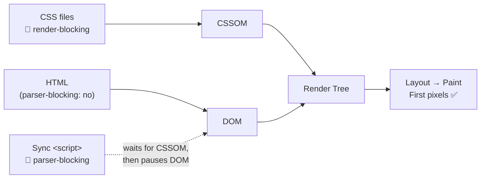
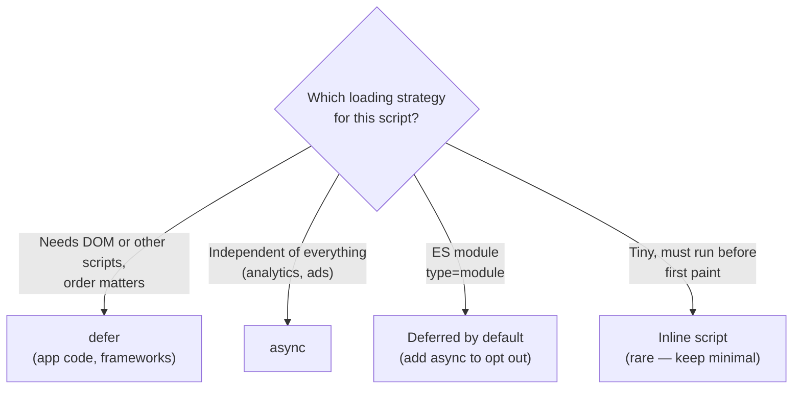
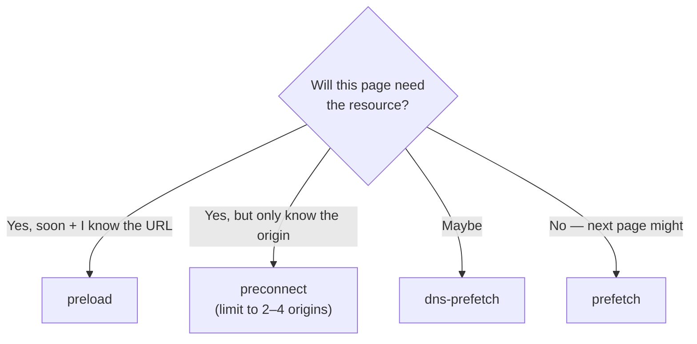
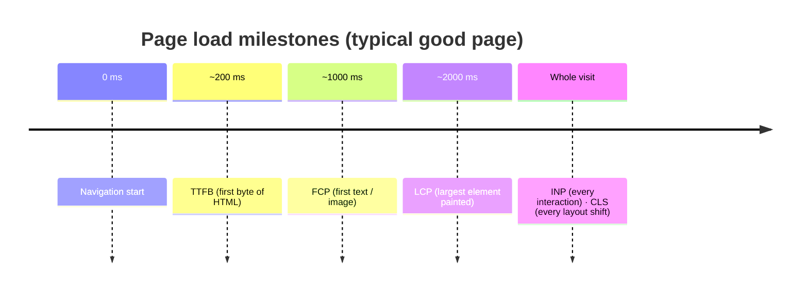
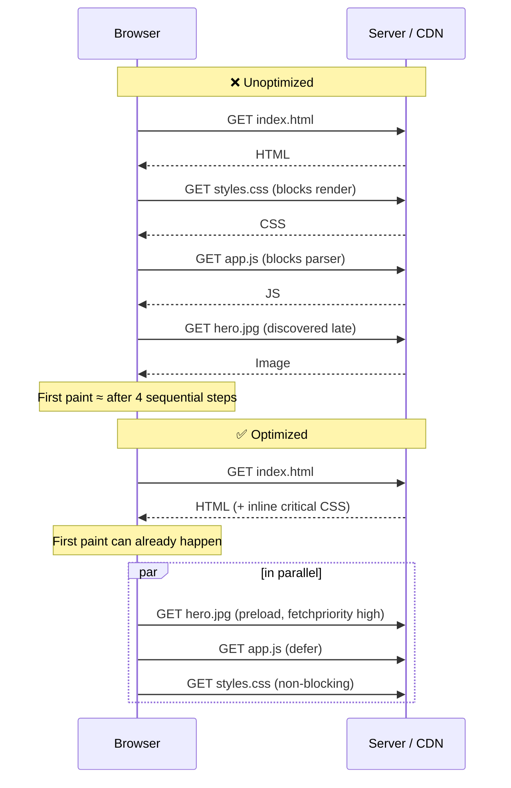

# Critical Rendering Path

> **Date:** 2026-03-25 · **Last updated:** 2026-10-08
> **Category:** Frontend System Design
> **Sub-Topic:** Performance / Rendering
> **Level:** Intermediate · **Reading time:** ~18 min

> **Pre-requisite:** Read [How Browsers Work](./how-browsers-work.md) first.
> This note focuses on **optimizing** the pipeline — not explaining it from scratch.

**Previous:** [How Browsers Work](./how-browsers-work.md) · **Next:** [Browser Storage Mechanisms](./browser-storage-mechanisms.md)

---

## Table of Contents

1. [ELI5 — Simple Explanation](#eli5--simple-explanation)
2. [Section 1: What is the Critical Rendering Path?](#section-1-what-is-the-critical-rendering-path)
3. [Section 2: Render-Blocking Resources](#section-2-render-blocking-resources)
4. [Section 3: Resource Hints](#section-3-resource-hints)
5. [Section 4: Inlining Critical CSS](#section-4-inlining-critical-css)
6. [Section 5: Font Optimization](#section-5-font-optimization)
7. [Section 6: Metrics — Core Web Vitals](#section-6-crp-performance-metrics)
8. [Section 7: Optimizing LCP Step by Step](#section-7-optimizing-lcp-step-by-step)
9. [Visual — Optimized vs Unoptimized](#visual--optimized-vs-unoptimized)
10. [Real-World Examples](#real-world-examples)
11. [Key Points Summary](#key-points-summary)
12. [Test Your Understanding (with answers)](#test-your-understanding)
13. [Cheat Sheet](#cheat-sheet)
14. [References & Further Reading](#references--further-reading)

---

## ELI5 — Simple Explanation

Imagine a new restaurant opening day:
- Without optimization: Chef waits for ALL ingredients before cooking anything → customers wait forever
- With optimization: Chef starts cooking with available ingredients, orders the rest in parallel → first dish out fast

> **CRP = The minimum steps browser MUST complete before showing ANYTHING on screen.**
> **Optimizing CRP = reducing what blocks those first steps.**

---

## Core Concept — Step by Step

### Section 1: What is the Critical Rendering Path?

The **Critical Rendering Path (CRP)** is specifically about:
- **Which resources block** the browser from rendering
- **How many bytes** must download before first render
- **How many round trips** to the server are required

```
GOAL: Get pixels on screen as fast as possible

PROBLEM: Some resources BLOCK the pipeline
         Until they finish downloading → nothing renders

SOLUTION: Identify + eliminate blocking resources
```



**Three CRP metrics:**

| Metric | What it measures | How to reduce |
|---|---|---|
| **Critical Resources** | Files that block rendering | Fewer files, inline critical CSS |
| **Critical Bytes** | Total size of blocking files | Minify, compress (gzip/brotli) |
| **Critical Round Trips** | Network requests needed | HTTP/2+, preload, reduce files |

---

### Section 2: Render-Blocking Resources

#### CSS — Always Render-Blocking

```html
<!-- Browser STOPS rendering until this fully downloads -->
<link rel="stylesheet" href="styles.css">
```

Why? The browser needs the CSSOM to build the Render Tree → needs the Render Tree to paint → nothing shows until CSS loads. CSS also **blocks script execution**: a script after a stylesheet waits for that stylesheet, because the script might read computed styles.

#### JavaScript — Parser-Blocking by Default

```html
<!-- Default: STOPS HTML parsing AND delays rendering -->
<script src="app.js"></script>
```

**The fix — `defer` vs `async`:**

```
DEFAULT <script>:
HTML:  ████████░░░░░░░░░░░████████  ← paused while JS downloads + runs
JS:            ████████████

DEFER:
HTML:  ████████████████████████    ← never paused
JS:            ████████████░░░░    ← runs AFTER HTML fully parsed, in order

ASYNC:
HTML:  ████████████░░████████████  ← paused only when JS actually runs
JS:            ████████████        ← runs immediately when downloaded, any order
```



**When to use which:**

| | `defer` | `async` |
|---|---|---|
| Needs DOM ready | ✅ Yes | ❌ No |
| Order matters | ✅ Preserves order | ❌ Random order |
| Use for | App scripts, frameworks | Analytics, ads, independent scripts |

> `defer` and `async` only work on **external** scripts (with `src`). Both download in parallel with HTML parsing.

---

### Section 3: Resource Hints

Tell the browser what it needs **before** it discovers it in HTML:

```html
<!-- preload: fetch THIS file RIGHT NOW (critical for current page) -->
<link rel="preload" href="hero.jpg" as="image">
<link rel="preload" href="main.js" as="script">
<link rel="preload" href="font.woff2" as="font" type="font/woff2" crossorigin>

<!-- preconnect: open TCP+TLS to domain early (no file yet) -->
<link rel="preconnect" href="https://fonts.googleapis.com">

<!-- dns-prefetch: just DNS lookup early (cheaper than preconnect) -->
<link rel="dns-prefetch" href="https://api.mysite.com">

<!-- prefetch: fetch for NEXT page navigation (low priority) -->
<link rel="prefetch" href="next-page-bundle.js">
```

**When to use each:**

| Hint | Use when | Priority |
|---|---|---|
| `preload` | Current page needs this file soon | 🔴 High — fetch immediately |
| `preconnect` | Will request from this domain soon | 🟡 Medium — open connection |
| `dns-prefetch` | May request from this domain | 🟢 Low — just DNS |
| `prefetch` | Next page will need this file | 🔵 Idle — download when quiet |



**Also worth knowing:**
- `fetchpriority="high" | "low"` on ``, `<link>`, `<script>` raises/lowers the browser's own priority guess.
- `<link rel="modulepreload">` preloads ES modules (and their dependencies).
- **HTTP 103 Early Hints** lets the server send `preload`/`preconnect` hints *while it is still generating the HTML*, hiding server think-time.
- The browser's **preload scanner** already discovers ``, `<link>` and `<script src>` in raw HTML early — but it cannot see resources referenced from CSS (`background-image`, `@font-face`) or injected by JS. Those are the best candidates for `preload`.

---

### Section 4: Inlining Critical CSS

**Critical CSS** = styles for content visible without scrolling (above the fold).

```html
<head>
  <!-- INLINE: renders immediately, zero network cost -->
  <style>
    /* Only above-the-fold styles — aim for well under 14KB (compressed) */
    body  { margin: 0; font-family: sans-serif; }
    .hero { background: #1a1a2e; color: white; padding: 60px; }
    .nav  { display: flex; justify-content: space-between; }
  </style>

  <!-- DEFER rest of CSS: non-blocking trick -->
  <link rel="stylesheet"
        href="full-styles.css"
        media="print"
        onload="this.media='all'">
  <noscript>
    <link rel="stylesheet" href="full-styles.css">
  </noscript>
</head>
```

**Why the 14KB guideline?** → TCP's initial congestion window is 10 segments × ~1460 bytes ≈ 14KB, so the first round trip carries ~14KB before the server must wait for an ACK. HTML + inline CSS that fits in that first flight renders without an extra round trip. (See [RFC 6928 — Increasing TCP's Initial Window](https://datatracker.ietf.org/doc/html/rfc6928), which raised the older limit set by RFC 3390.) It is a **rule of thumb**, not a hard rule — and compression is applied before the window limit.

> **Tooling:** don't hand-write critical CSS. Generate it at build time (e.g. [Critters](https://github.com/GoogleChromeLabs/critters), [Critical](https://github.com/addyosmani/critical)) or use your framework's built-in support.

---

### Section 5: Font Optimization

Fonts are a common CRP bottleneck:

```html
<!-- BAD: no font-display → browser may hide text until the font arrives (FOIT) -->
<link href="https://fonts.googleapis.com/css?family=Inter" rel="stylesheet">

<!-- GOOD (hosted fonts): preconnect + display=swap -->
<link rel="preconnect" href="https://fonts.googleapis.com">
<link rel="preconnect" href="https://fonts.gstatic.com" crossorigin>
<link rel="stylesheet"
      href="https://fonts.googleapis.com/css2?family=Inter:wght@400;700&display=swap">
```

**Best: self-host + preload the one font that matters for LCP**

```html
<link rel="preload" href="/fonts/inter-var.woff2" as="font" type="font/woff2" crossorigin>

<style>
  @font-face {
    font-family: 'Inter';
    src: url('/fonts/inter-var.woff2') format('woff2');
    font-display: swap;   /* show fallback instantly, swap when loaded */
  }
</style>
```

| `font-display` | Behavior | Use when |
|---|---|---|
| `swap` | Fallback shown immediately, swaps when ready | Body text; avoids invisible text |
| `optional` | Uses the web font only if it's already available very quickly | Best for CLS; non-critical fonts |
| `block` | Invisible text up to ~3s | Icon fonts (avoid fallback glyph chaos) |

> **Watch out:** `swap` can cause a layout shift when the fallback and web font have different metrics. Reduce it with `size-adjust`, `ascent-override` in an `@font-face` for the fallback, or use `optional`.

---

### Section 6: CRP Performance Metrics

The three **Core Web Vitals** (field metrics Google ranks on) are **LCP, INP, CLS**. The rest are lab/supporting metrics. (INP replaced FID as a Core Web Vital in March 2024.) Thresholds are judged at the **75th percentile** of real-user page loads.

| Metric | Measures | Good Target | Type |
|---|---|---|---|
| **LCP** — Largest Contentful Paint | Main content visible | ≤ 2.5s | 🟢 Core Web Vital |
| **INP** — Interaction to Next Paint | Responsiveness to user input | ≤ 200ms | 🟢 Core Web Vital |
| **CLS** — Cumulative Layout Shift | Visual stability | ≤ 0.1 | 🟢 Core Web Vital |
| **FCP** — First Contentful Paint | First text/image visible | ≤ 1.8s | Lab / supporting |
| **TTFB** — Time To First Byte | Server + network latency | ≤ 0.8s | Supporting |
| **TBT** — Total Blocking Time | JS blocking main thread | ≤ 200ms | Lab (proxy for INP) |
| **TTI** — Time To Interactive | Page fully usable | ≤ 3.8s | Lab (deprecated in Lighthouse 10) |



---

### Section 7: Optimizing LCP Step by Step

LCP time is the sum of four sub-parts (per [web.dev — Optimize LCP](https://web.dev/articles/optimize-lcp)). Find which one is biggest, then fix **that**:


| Sub-part | Symptom | Fix |
|---|---|---|
| **TTFB** | Slow server / no CDN | CDN, caching, Early Hints, faster backend |
| **Resource load delay** | LCP image discovered late (CSS bg image, JS-injected, `loading="lazy"`) | Put `` in the HTML, `preload`, `fetchpriority="high"`, never lazy-load the LCP image |
| **Resource load duration** | Heavy image | AVIF/WebP, responsive `srcset`, right dimensions, CDN |
| **Element render delay** | Render-blocking CSS/JS, client-side rendering | Inline critical CSS, `defer` scripts, SSR/SSG instead of CSR |

---

## Visual — Optimized vs Unoptimized

```
❌ UNOPTIMIZED:
────────────────────────────────────────────────────────
HTML:       ████
            → hits <link css> → STOP
CSS:              ████████████████
                                  → hits <script> → STOP
JS:                               ████████████
Render Tree:                                  ██
Layout:                                         ██
First Paint:                                      ✅ SLOW (1.8s+)


✅ OPTIMIZED:
────────────────────────────────────────────────────────
Critical CSS: (inlined in HTML, no extra request)
HTML:       ████
            → CSSOM ready immediately from inline CSS
JS defer:       ████████ (parallel download, runs after)
Render Tree:        ██
Layout:               ██
First Paint:            ✅ FAST (< 0.5s)
```

*(Illustrative timings — real numbers depend on network, device and page weight.)*



---

## Real-World Examples

**Example 1 — Correct script loading:**
```html
<head>
  <!-- Analytics: independent, load async -->
  <script async src="analytics.js"></script>

  <!-- Preload app bundle so it's ready when needed -->
  <link rel="preload" href="app.js" as="script">
</head>
<body>
  <div id="app"></div>

  <!-- App: needs DOM, runs after parse, in order -->
  <script defer src="vendors.js"></script>
  <script defer src="app.js"></script>
</body>
```

**Example 2 — Hero image optimization (LCP fix):**
```html
<!-- BAD: lazy-loaded LCP image — the browser delays it on purpose -->


<!-- GOOD: visible in HTML, high priority, responsive, dimensions set (no CLS) -->
<link rel="preload" as="image" href="hero-1200.avif"
      imagesrcset="hero-600.avif 600w, hero-1200.avif 1200w"
      imagesizes="100vw" fetchpriority="high">

```

**Example 3 — Eliminate render-blocking CSS:**
```html
<!-- BAD: all CSS blocks render -->
<link rel="stylesheet" href="styles.css">
<link rel="stylesheet" href="animations.css">
<link rel="stylesheet" href="print.css">

<!-- GOOD: only critical CSS blocks, rest deferred -->
<style>/* critical above-fold styles inlined */</style>
<link rel="stylesheet" href="styles.css" media="print" onload="this.media='all'">
<link rel="stylesheet" href="animations.css" media="print" onload="this.media='all'">
<link rel="stylesheet" href="print.css" media="print">
```

**Example 4 — Measure it in the field (not just in Lighthouse):**
```javascript
// npm i web-vitals  — reports real-user LCP / INP / CLS
import { onLCP, onINP, onCLS } from 'web-vitals';

function send(metric) {
  navigator.sendBeacon('/analytics', JSON.stringify(metric));
}
onLCP(send);
onINP(send);
onCLS(send);
```

---

## Key Points Summary

| Concept | One-Line Explanation |
|---|---|
| **CRP** | Minimum steps before browser shows anything on screen |
| **Render-blocking CSS** | ALL CSS files block rendering until downloaded |
| **Parser-blocking JS** | Default `<script>` stops HTML parsing |
| **defer** | Script runs after HTML parsed, in order |
| **async** | Script runs immediately when downloaded, any order |
| **Critical CSS** | Above-the-fold styles inlined in `<head>` |
| **preload** | Force-fetch critical resource immediately |
| **preconnect** | Open connection to domain early |
| **fetchpriority** | Hint to raise/lower a resource's download priority |
| **Early Hints (103)** | Server sends preload hints before the HTML is ready |
| **FCP** | First Contentful Paint — first visible text/image |
| **LCP** | Largest Contentful Paint — main content visible (Core Web Vital) |
| **INP** | Interaction to Next Paint — input responsiveness (Core Web Vital) |
| **CLS** | Cumulative Layout Shift — visual stability (Core Web Vital) |

---

## Test Your Understanding

**Q1 (Basic):**
A page has 3 `<link>` CSS files and 2 `<script>` tags (no `defer`/`async`).
How many render-blocking resources are there?

<details>
<summary>Answer</summary>

**5.** All three stylesheets block rendering, and both synchronous scripts block the parser (and wait for pending CSS before executing), so they delay first render too. Adding `defer` to the scripts and deferring non-critical CSS cuts this to 1 (or 0 with inlined critical CSS).
</details>

**Q2 (Application):**
Your LCP score is 4.2s — too slow. The LCP element is a hero image.
List 3 specific techniques with code to fix it.

<details>
<summary>Answer</summary>

1. **Make it discoverable early:** put the `` in the HTML (not a CSS background or JS-injected) and add `<link rel="preload" as="image" ...>`.
2. **Raise priority & don't lazy-load:** ``, remove `loading="lazy"` from the LCP image.
3. **Shrink the bytes:** AVIF/WebP, `srcset`/`sizes`, correct dimensions, serve from a CDN.
4. (Bonus) Reduce TTFB with a CDN/caching/Early Hints, and unblock rendering with inline critical CSS + `defer`.

Always diagnose first: check which of the four LCP sub-parts is largest (see Section 7).
</details>

**Q3 (Tricky):**
A developer adds `<link rel="preload" as="script" href="app.js">` but forgets the actual `<script src="app.js">` tag.
What happens? Does preload help here?

<details>
<summary>Answer</summary>

The file is downloaded at high priority and sits in the cache, but **it is never executed** — preload only fetches. Nothing improves and bandwidth is wasted. Chrome logs a console warning that the resource "was preloaded but not used within a few seconds".
</details>

**Q4 (Tricky):**
Why does `async` on two interdependent scripts sometimes break the app only on some page loads?

<details>
<summary>Answer</summary>

`async` scripts execute as soon as each one finishes downloading, so the order depends on network timing. If `b.js` needs a global from `a.js`, it works when `a.js` happens to arrive first and fails otherwise. Use `defer`, which preserves document order.
</details>

---

## Cheat Sheet

**Key Definitions:**
- **CRP:** Minimum steps before first pixel on screen
- **Render-blocking:** Resource that pauses the rendering pipeline
- **Critical CSS:** Above-fold styles that must load for first paint
- **FCP:** First visible text or image
- **LCP:** Largest visible content element painted (Core Web Vital, ≤ 2.5s)
- **INP:** Responsiveness to user input across the visit (Core Web Vital, ≤ 200ms)
- **CLS:** Cumulative unexpected layout shift (Core Web Vital, ≤ 0.1)

**Essential HTML:**
```html
<!-- Script loading -->
<script defer src="x.js">    <!-- after HTML parse, in order -->
<script async src="x.js">    <!-- immediately when ready, no order -->

<!-- Resource hints -->
<link rel="preload" href="x" as="font|script|style|image">
<link rel="preconnect" href="https://domain.com">
<link rel="dns-prefetch" href="https://domain.com">
<link rel="prefetch" href="next-page.js">

<!-- Priority -->


<!-- Non-blocking CSS -->
<link rel="stylesheet" href="x.css"
      media="print" onload="this.media='all'">

<!-- Font display -->
font-display: swap;
```

**CRP Optimization Checklist:**
```
✅ Inline critical (above-fold) CSS in <head>
✅ Defer all non-critical CSS with media="print" trick
✅ defer app scripts, async analytics/ads
✅ preconnect to Google Fonts, CDN domains
✅ preload hero image with fetchpriority="high" (never lazy-load it)
✅ preload critical fonts
✅ font-display: swap (or optional) for web fonts
✅ Minify + gzip/brotli all assets
✅ HTTP/2 or HTTP/3 to reduce round trips
✅ Keep inline critical CSS small (≈14KB guideline)
✅ Set width/height on images to prevent CLS
✅ Measure with real-user data (web-vitals / CrUX), not just Lighthouse
```

**Common Mistakes to Avoid:**

| Mistake | Why Wrong | Fix |
|---|---|---|
| `<script>` in `<head>` no defer | Blocks HTML parsing | Add `defer` or move to bottom of `<body>` |
| All CSS in one unsplit file | Entire file blocks render | Inline critical + defer rest |
| No `preconnect` for Google Fonts | Extra DNS+TCP delay | Add `<link rel="preconnect">` |
| `async` for interdependent scripts | Runs out of order, breaks app | Use `defer` for ordered execution |
| Hero image not preloaded / lazy-loaded | LCP is slow | `fetchpriority="high"`, no `loading="lazy"` |
| `preload` without using the resource | Wastes bandwidth | Only preload what current page uses |
| Too many `preload` / `preconnect` | Competes with truly critical requests | Keep to a handful |
| Third-party scripts not async | Blocks entire page for external server | Always `async` or `defer` third-party |
| Optimizing only for Lighthouse | Lab ≠ real users | Track field data (CrUX, RUM) |

---

## References & Further Reading

**Core docs**
- MDN: [Critical rendering path](https://developer.mozilla.org/en-US/docs/Web/Performance/Guides/Critical_rendering_path)
- MDN: [`<link rel="preload">`](https://developer.mozilla.org/en-US/docs/Web/HTML/Reference/Attributes/rel/preload)
- MDN: [`<script>` — `async` and `defer`](https://developer.mozilla.org/en-US/docs/Web/HTML/Reference/Elements/script#async)
- Chrome for Developers: [Eliminate render-blocking resources](https://developer.chrome.com/docs/lighthouse/performance/render-blocking-resources)
- web.dev: [Critical rendering path](https://web.dev/articles/critical-rendering-path)
- web.dev: [Defer non-critical CSS](https://web.dev/articles/defer-non-critical-css)
- web.dev: [Extract critical CSS](https://web.dev/articles/extract-critical-css)

**Core Web Vitals**
- web.dev: [Web Vitals](https://web.dev/articles/vitals)
- web.dev: [Largest Contentful Paint (LCP)](https://web.dev/articles/lcp) · [Optimize LCP](https://web.dev/articles/optimize-lcp)
- web.dev: [Interaction to Next Paint (INP)](https://web.dev/articles/inp)
- web.dev: [Cumulative Layout Shift (CLS)](https://web.dev/articles/cls)
- Library: [`web-vitals`](https://github.com/GoogleChrome/web-vitals) — measure CWV in the field

**Resource loading**
- web.dev: [Fetch Priority API](https://web.dev/articles/fetch-priority)
- web.dev: [Preload critical assets](https://web.dev/articles/preload-critical-assets)
- web.dev: [Establish network connections early (preconnect & dns-prefetch)](https://web.dev/articles/preconnect-and-dns-prefetch)
- web.dev: [Best practices for fonts](https://web.dev/articles/font-best-practices)
- Chrome for Developers: [103 Early Hints](https://developer.chrome.com/docs/web-platform/early-hints)

**Specs**
- IETF: [RFC 6928 — Increasing TCP's Initial Window](https://datatracker.ietf.org/doc/html/rfc6928) (the 14KB rule)
- WHATWG: [HTML Standard — scripting (`async`/`defer`)](https://html.spec.whatwg.org/multipage/scripting.html)

---

> **Previous Topic:** [How Browsers Work](./how-browsers-work.md)
> — Understand the full browser pipeline before optimizing it

> **Next Topic:** [Browser Storage Mechanisms](./browser-storage-mechanisms.md)
> — Where and how the browser stores data on the client

*Saved on: 2026-03-25 · Updated: 2026-10-08 | Repo: Frontend System Design Learning Notes*
