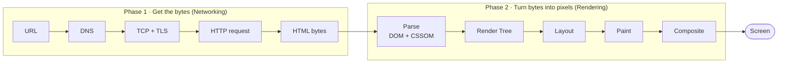
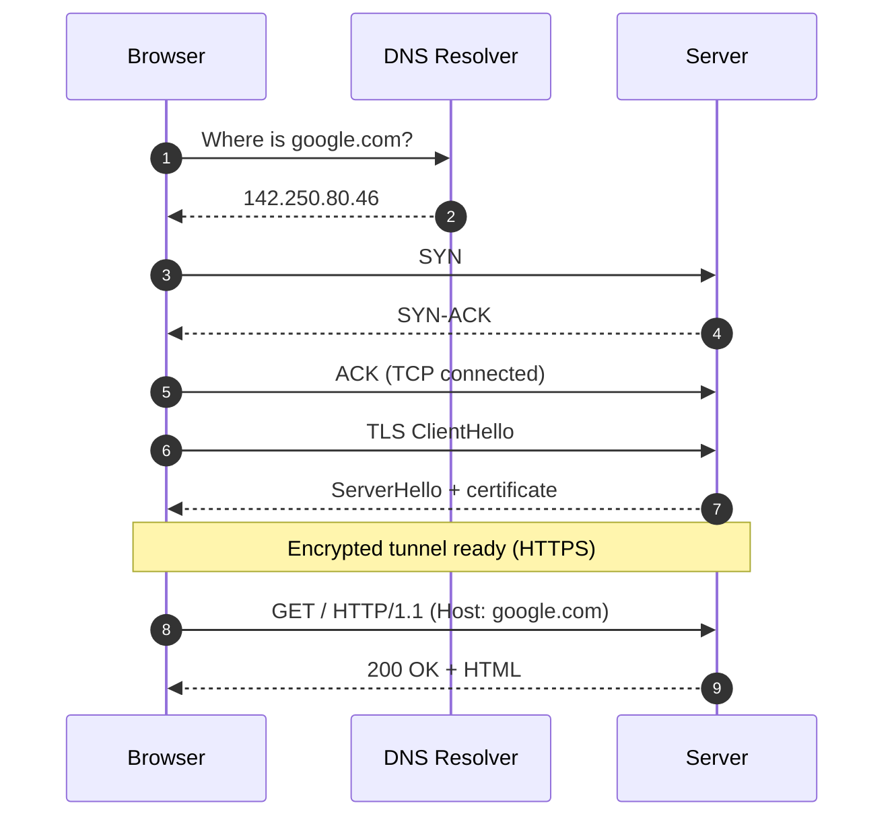
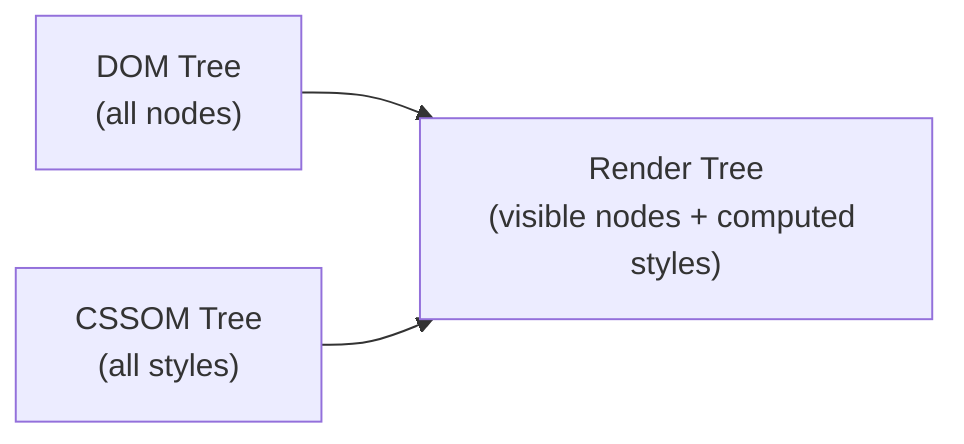
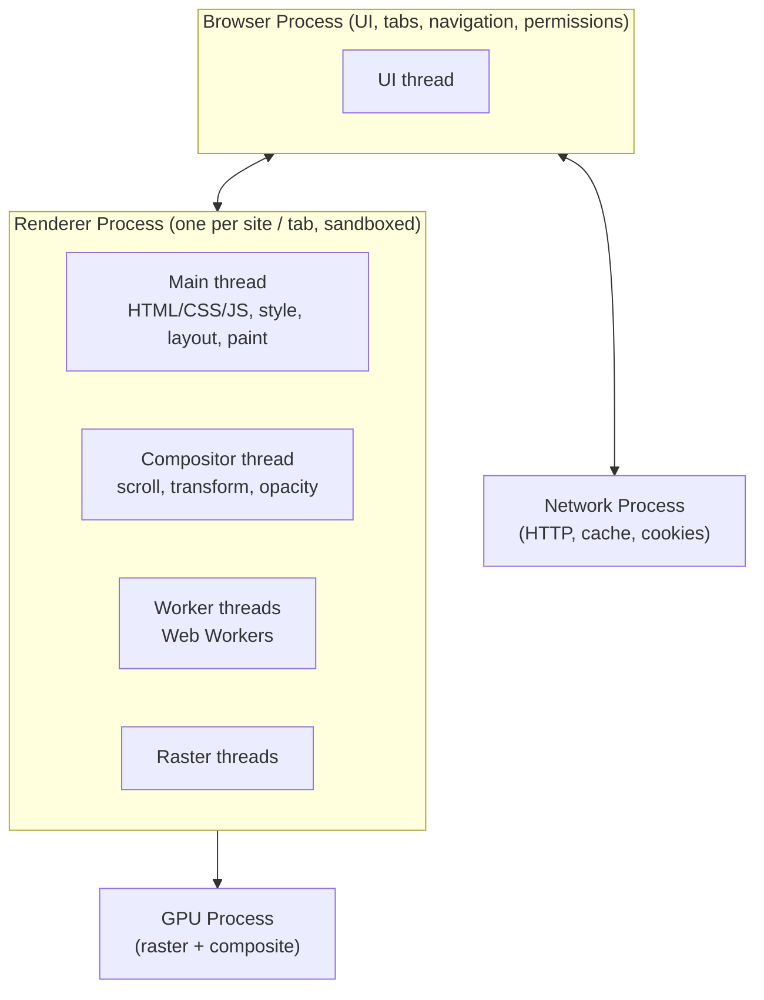
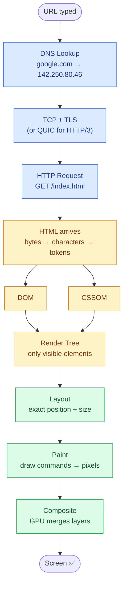
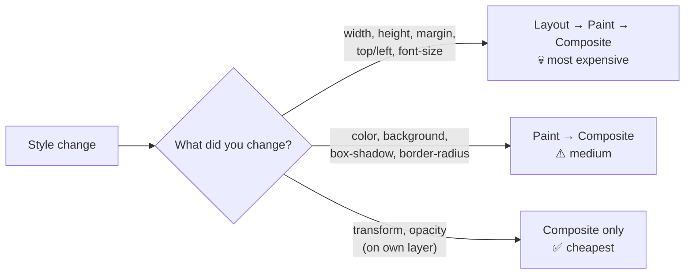

# How Browsers Work

> **Date:** 2026-03-25 · **Last updated:** 2026-10-08
> **Category:** Frontend System Design
> **Sub-Topic:** Browser Internals / Rendering
> **Level:** Beginner → Intermediate · **Reading time:** ~15 min

**Next topic:** [Critical Rendering Path](./critical-rendering-path.md)

---

## Table of Contents

1. [ELI5 — Simple Explanation](#eli5--simple-explanation)
2. [Big Picture](#big-picture)
3. [Section 1: Networking — URL to HTML](#section-1-networking--url-to-html)
4. [Section 2: HTML Parsing → DOM](#section-2-html-parsing--dom-tree)
5. [Section 3: CSS Parsing → CSSOM](#section-3-css-parsing--cssom-tree)
6. [Section 4: Render Tree](#section-4-render-tree--dom--cssom)
7. [Section 5: Layout (Reflow)](#section-5-layout-reflow)
8. [Section 6: Paint (Repaint)](#section-6-paint-repaint)
9. [Section 7: Compositing](#section-7-compositing--final-screen)
10. [Section 8: Multi-Process Architecture](#section-8-multi-process-architecture-chromium)
11. [Which CSS Change Costs What?](#which-css-change-costs-what)
12. [Real-World Examples](#real-world-examples)
13. [Key Points Summary](#key-points-summary)
14. [Test Your Understanding (with answers)](#test-your-understanding)
15. [Cheat Sheet](#cheat-sheet)
16. [References & Further Reading](#references--further-reading)

---

## ELI5 — Simple Explanation

Imagine you order food at a restaurant:
- You give your **order** (URL) to the waiter (browser)
- Waiter goes to the **kitchen** (server) and fetches food (HTML/CSS/JS)
- Kitchen **prepares and plates** it (parses + builds render tree)
- You **see the final dish** on your table (pixels on screen)

> **Browser = Messenger + Chef + Painter**
> It fetches, processes, and paints everything you see.

---

## Big Picture

Everything a browser does between "user hits Enter" and "pixels on screen" falls into **two phases**:



---

## Core Concept — Step by Step

### Section 1: Networking — URL to HTML



```
You type: https://google.com
         ↓
Step 1 → DNS Lookup
         "google.com" → IP address (142.250.80.46)
         (like a phone book — domain to IP)
         ↓
Step 2 → TCP 3-Way Handshake
         Client: SYN  →  Server: SYN-ACK  →  Client: ACK
         (knocking on a door and waiting for "come in")
         ↓
Step 3 → TLS Handshake  (HTTPS only)
         Encrypted secure tunnel established
         ↓
Step 4 → HTTP GET Request sent
         GET / HTTP/1.1
         Host: google.com
         ↓
Step 5 → Server responds with HTML file
```

| Term | Simple Meaning |
|---|---|
| **DNS** | Phone book — converts domain to IP |
| **TCP Handshake** | Confirm connection before sending data |
| **TLS** | Locks the conversation so no one can spy |
| **HTTP GET** | Browser asks server: "please send me this page" |

> **Modern note (HTTP/3):** HTTP/3 runs over **QUIC** (on UDP), which merges the transport and TLS 1.3 handshakes into a single round trip, so the separate TCP step above disappears. The browser also checks caches (memory, disk, Service Worker) *before* going to the network. See [RFC 9114 (HTTP/3)](https://datatracker.ietf.org/doc/html/rfc9114) and [RFC 8446 (TLS 1.3)](https://datatracker.ietf.org/doc/html/rfc8446).

---

### Section 2: HTML Parsing → DOM Tree

Once HTML arrives, the browser starts **parsing** (reading it incrementally as bytes stream in):


**What is the DOM?**
> DOM = HTML converted into a **tree of objects** that JavaScript can read and modify.

```
HTML:                     DOM Tree:
<html>                    Document
  <body>                  └── html
    <h1>Hello</h1>             └── body
    <p>World</p>                    ├── h1 → "Hello"
  </body>                          └── p  → "World"
</html>
```

**Important rules:**
- When the parser hits a plain `<script>` tag it **pauses** DOM construction until the script downloads and runs (JS can call `document.write()` and change the DOM).
- Browsers run a **preload scanner** that looks ahead in the raw HTML and starts downloading images, CSS and scripts early, so a blocked parser does not mean a blocked network.
- The HTML parser is **forgiving**: bad markup is repaired per the spec rather than throwing errors.

(Full treatment of blocking behavior → [Critical Rendering Path](./critical-rendering-path.md).)

---

### Section 3: CSS Parsing → CSSOM Tree

While the DOM is being built, the browser also parses CSS into the **CSSOM** (CSS Object Model):

```
Raw CSS string
      ↓
  CSSOM Tree
  (every element gets computed styles)
```

```
CSS:                      CSSOM:
body { font-size: 16px }  body → font-size: 16px
h1   { color: red }            └── h1 → color: red (inherits 16px)
p    { margin: 8px }           └── p  → margin: 8px (inherits 16px)
```

**Key rules:**
- CSS **cascades** — child elements inherit from parents, and rules are resolved by specificity and source order.
- CSS is **render-blocking**: the browser will not paint until the CSSOM is ready, otherwise users would see a flash of unstyled content.

---

### Section 4: Render Tree = DOM + CSSOM

The browser combines the DOM and CSSOM into a **Render Tree** (Chromium calls the style-resolution step *Recalculate Style*):



**Important difference — DOM vs Render Tree:**

| | DOM Tree | Render Tree |
|---|---|---|
| `display: none` | ✅ included | ❌ excluded (not rendered) |
| `visibility: hidden` | ✅ included | ✅ included (takes space, invisible) |
| `opacity: 0` | ✅ included | ✅ included (takes space, invisible, still receives clicks) |
| `<head>`, `<script>`, `<meta>` | ✅ included | ❌ excluded (not visual) |
| `::before` / `::after` | ❌ not in DOM | ✅ included (generated by CSS) |

> **Rule:** DOM = everything in HTML. Render Tree = only what the user can see (plus CSS-generated content).

---

### Section 5: Layout (Reflow)

The browser calculates the **exact position and size** of every element in the Render Tree:

```
Render Tree
     ↓
  Layout Engine
     ↓
  Box Model for each element:
  ┌─────────────────────┐
  │       margin        │
  │  ┌───────────────┐  │
  │  │    border     │  │
  │  │  ┌─────────┐  │  │
  │  │  │ padding │  │  │
  │  │  │ CONTENT │  │  │
  │  │  └─────────┘  │  │
  │  └───────────────┘  │
  └─────────────────────┘
  x, y position on screen calculated
```

**Reflow** = recalculating layout. Triggered by:
- Changing `width`, `height`, `font-size`, `margin`, `padding`, `top/left`
- Adding or removing elements from the DOM
- Resizing the browser window
- Reading layout properties (`offsetWidth`, `getBoundingClientRect()`) right after a style write — this forces a **synchronous** reflow ("layout thrashing")

> **Reflow is usually the most expensive rendering step** — a change to one element can invalidate the layout of its children, siblings and ancestors. Avoid triggering it unnecessarily.

---

### Section 6: Paint (Repaint)

The browser fills in the actual **pixels** for each element (text, colors, borders, shadows, images):

```
Layout
  ↓
Paint  → builds a list of draw commands per layer
  ↓
Raster → converts draw commands into pixels (often on the GPU)
```

**Repaint** = redrawing pixels without a layout change. Triggered by:
- Color change
- Background change
- `box-shadow`, `outline`, `border-radius` change
- `visibility: hidden/visible` toggle

> **Repaint is cheaper than Reflow** — no position recalculation needed — but large repaints (full-screen gradients, big shadows) are still costly.

---

### Section 7: Compositing — Final Screen

The page is split into **layers**. The GPU combines them into the final image:

```
Layer 1: background
Layer 2: main content
Layer 3: fixed navbar
Layer 4: modal/popup
      ↓
  GPU composites all layers
      ↓
  Final screen ✅
```

**Why `transform` and `opacity` are special:**
> They can be handled at the **Composite** step alone — the GPU moves/blends an existing layer directly.
> No Layout recalc, no Paint — that's why they're smooth at 60fps.
> *Caveat:* this only holds when the element is on its own compositor layer (promote it with `will-change: transform`). Otherwise the browser may still repaint. Do not promote everything — each layer costs GPU memory.

```css
/* Triggers Layout + Paint + Composite (slow) */
.box { left: 100px; }

/* Triggers Composite ONLY (fast, GPU) */
.box { transform: translateX(100px); }
```

---

### Section 8: Multi-Process Architecture (Chromium)

Modern browsers are not one program. Chromium splits work across processes so a crashing tab doesn't take down the browser and untrusted web content is sandboxed.



| Process / Thread | Responsibility |
|---|---|
| **Browser process** | Address bar, bookmarks, back/forward, permissions, coordinates other processes |
| **Network process** | Sends requests, handles cache + cookies |
| **Renderer process** | Runs everything for a page: HTML/CSS parsing, JavaScript, layout, paint. One per site (site isolation) |
| **Main thread** (in renderer) | JS, style, layout, paint. **A long JS task here freezes input and rendering** |
| **Compositor thread** | Handles scrolling and compositor-only animations even if the main thread is busy |
| **GPU process** | Rasterizes and composites layers |

> **Why this matters for frontend engineers:** the main thread is a single lane. Long JavaScript tasks block rendering and clicks (bad INP); animations on `transform`/`opacity` keep running on the compositor thread and stay smooth.

---

## Full Visual Pipeline



<details>
<summary>Same pipeline as plain-text (for terminals / offline readers)</summary>

```
[ URL TYPED ]
      │
      ▼
┌─────────────┐
│  DNS Lookup │  google.com → 142.250.80.46
└──────┬──────┘
       ▼
┌─────────────┐
│ TCP + TLS   │  Secure connection established
└──────┬──────┘
       ▼
┌─────────────┐
│ HTTP Request│  GET /index.html
└──────┬──────┘
       ▼
┌─────────────┐
│ HTML arrives│  Raw bytes → characters → tokens
└──────┬──────┘
  ┌────┴────┐
  ▼         ▼
┌─────┐  ┌───────┐
│ DOM │  │ CSSOM │   Built in parallel
└──┬──┘  └───┬───┘
   └────┬────┘
        ▼
  ┌───────────┐
  │Render Tree│   Only visible elements
  └─────┬─────┘
        ▼
  ┌───────────┐
  │  Layout   │   Exact position + size
  └─────┬─────┘
        ▼
  ┌───────────┐
  │   Paint   │   Colors + pixels
  └─────┬─────┘
        ▼
  ┌───────────┐
  │ Composite │   GPU merges layers
  └─────┬─────┘
        ▼
  [ SCREEN ✅ ]
```

</details>

---

## Which CSS Change Costs What?

When a style changes, the browser re-runs the pipeline **from the earliest stage that is affected**:



| Property changed | Layout | Paint | Composite | Cost |
|---|:---:|:---:|:---:|---|
| `width`, `height`, `margin`, `padding`, `top`, `left`, `font-size` | ✅ | ✅ | ✅ | 💀 High |
| `color`, `background-color`, `box-shadow`, `border-radius`, `visibility` | ❌ | ✅ | ✅ | ⚠️ Medium |
| `transform`, `opacity` (promoted layer) | ❌ | ❌ | ✅ | ✅ Low |

Look up any property: [CSS Triggers](https://csstriggers.com/) · [What forces layout/reflow (Paul Irish)](https://gist.github.com/paulirish/5d52fb081b3570c81e3a)

---

## Real-World Examples

**Example 1 — DOM vs Render Tree:**
```html
<div style="display: none">Hidden</div>  <!-- in DOM, NOT in Render Tree -->
<div style="visibility: hidden">Ghost</div> <!-- in DOM AND Render Tree (takes space) -->
<div>Visible</div>  <!-- in both -->
```

**Example 2 — Layout thrashing (forced synchronous reflow):**
```javascript
// BAD: interleaves write → read → write → read.
// Each read of offsetWidth forces the browser to run layout immediately.
for (let i = 0; i < 100; i++) {
  el.style.width = el.offsetWidth + 10 + 'px';  // up to 100 forced reflows!
}

// GOOD: read once, then do writes only. Layout runs once, after the loop.
let width = el.offsetWidth;
for (let i = 0; i < 100; i++) {
  width += 10;
  el.style.width = width + 'px';
}
```

**Example 3 — Composite-only animation:**
```css
/* GPU-only, no reflow, no repaint → buttery smooth */
@keyframes slide {
  from { transform: translateX(0); }
  to   { transform: translateX(200px); }
}
```

**Example 4 — Find the bottleneck in DevTools:**
1. Open DevTools → **Performance** → record while interacting.
2. In the flame chart, look for purple **Layout** / **Recalculate Style** blocks and green **Paint** blocks.
3. A red-flagged "Forced reflow" warning points to the exact line causing layout thrashing.
4. **More tools → Rendering → Paint flashing** highlights repainted areas live.

---

## Key Points Summary

| Concept | One-Line Explanation |
|---|---|
| **DNS** | Domain name → IP address |
| **TCP Handshake** | 3-step connection confirmation (HTTP/3 uses QUIC instead) |
| **DOM** | HTML parsed into a JavaScript-readable tree |
| **CSSOM** | CSS parsed into a styles tree |
| **Render Tree** | DOM + CSSOM — only visible elements |
| **Layout / Reflow** | Calculate exact size and position of every element |
| **Paint / Repaint** | Fill in pixels — colors, borders, text |
| **Composite** | GPU merges all layers → final screen |
| **Main thread** | Single lane for JS + style + layout + paint; keep tasks short |
| **display:none** | Removed from Render Tree entirely |
| **visibility:hidden** | In Render Tree but invisible (still takes space) |
| **transform/opacity** | Composite-only — fastest, GPU-handled |

---

## Test Your Understanding

**Q1 (Basic):**
What is the difference between the DOM and the Render Tree?
Give one example of an element that exists in DOM but NOT in Render Tree.

<details>
<summary>Answer</summary>

The DOM contains every node parsed from the HTML. The Render Tree contains only nodes that produce visual boxes, with their computed styles. `<head>`, `<script>`, and any element with `display: none` are in the DOM but not in the Render Tree. (`::before`/`::after` pseudo-elements are the reverse: in the Render Tree but not in the DOM.)
</details>

**Q2 (Application):**
A developer changes `width` of a `div` via JavaScript.
Which steps re-run: Layout, Paint, Composite — or all three? Why?

<details>
<summary>Answer</summary>

All three. `width` changes the box geometry, so Layout must recompute positions (including affected siblings/children), the changed area must be repainted, and the layers must be composited again. This is why animating `width` is much costlier than animating `transform`.
</details>

**Q3 (Tricky):**
`opacity: 0` and `display: none` both make elements invisible.
How do they differ in the Render Tree and in performance cost?

<details>
<summary>Answer</summary>

`display: none` removes the element from the Render Tree: no box, no space, no layout cost, and toggling it triggers layout. `opacity: 0` keeps the element in the Render Tree: it still occupies space, can still receive clicks and focus, and is still laid out; but toggling/animating it can be composite-only, so it is cheap to animate. Use `opacity` for fades and `display: none` to truly remove an element.
</details>

**Q4 (Tricky):**
Why can a CSS `transform` animation stay smooth while the page is busy running a long JavaScript task?

<details>
<summary>Answer</summary>

If the element is on its own compositor layer, the compositor thread animates it without involving the main thread (where JS, style, layout and paint run). A main-thread animation (e.g. animating `left`) stalls when JS blocks the main thread.
</details>

---

## Cheat Sheet

**Key Definitions:**
- **DNS:** Domain → IP address lookup
- **TCP Handshake:** 3-step connection setup (SYN → SYN-ACK → ACK)
- **DOM:** HTML → JavaScript tree of objects
- **CSSOM:** CSS → tree of computed styles
- **Render Tree:** DOM + CSSOM, visible elements only
- **Layout/Reflow:** Calculate position + size (usually most expensive)
- **Paint/Repaint:** Draw pixels — colors, borders (medium cost)
- **Composite:** GPU merges layers → screen (cheapest)

**Pipeline Order:**
```
DNS → TCP → TLS → HTTP → HTML
→ DOM + CSSOM (parallel)
→ Render Tree
→ Layout → Paint → Composite
→ Screen
```

**Cost Comparison:**
```
Reflow    = 💀 most expensive  → avoid in loops
Repaint   = ⚠️  medium cost    → minimize
Composite = ✅ cheapest        → prefer (transform, opacity)
```

**Common Mistakes to Avoid:**

| Mistake | Why Wrong | Fix |
|---|---|---|
| Reading `offsetWidth` between style writes in a loop | Forces a synchronous reflow every iteration | Batch reads first, then writes |
| Animating `top` / `left` | Triggers reflow + repaint every frame | Use `transform: translate()` |
| Confusing `display:none` vs `visibility:hidden` | Different Render Tree + cost behavior | `display:none` = out of tree; `visibility:hidden` = in tree |
| Changing many styles one by one | May cause extra style/layout work | Batch via a CSS class toggle |
| `will-change` on everything | Every layer uses GPU memory | Promote only elements that actually animate |
| Long JS tasks on the main thread | Blocks input, layout and paint | Split work, use Web Workers, `requestIdleCallback` |
| Large unoptimized images | Slow download, delays paint | Use WebP/AVIF, correct sizing |

---

## References & Further Reading

**Core docs**
- MDN: [Populating the page: how browsers work](https://developer.mozilla.org/en-US/docs/Web/Performance/Guides/How_browsers_work)
- MDN: [Critical rendering path](https://developer.mozilla.org/en-US/docs/Web/Performance/Guides/Critical_rendering_path)
- web.dev: [Rendering performance](https://web.dev/articles/rendering-performance)
- web.dev: [Stick to compositor-only properties and manage layer count](https://web.dev/articles/stick-to-compositor-only-properties-and-manage-layer-count)

**Browser internals (deep dives)**
- Chrome for Developers: [Inside look at modern web browser — Part 1: CPU, GPU, memory & multi-process architecture](https://developer.chrome.com/blog/inside-browser-part1)
- Chrome for Developers: [Part 3: Inner workings of a renderer process](https://developer.chrome.com/blog/inside-browser-part3)
- Chrome for Developers: [RenderingNG architecture](https://developer.chrome.com/docs/chromium/renderingng)

**Specs**
- WHATWG: [HTML Standard — Parsing HTML documents](https://html.spec.whatwg.org/multipage/parsing.html)
- IETF: [RFC 9114 — HTTP/3](https://datatracker.ietf.org/doc/html/rfc9114) · [RFC 8446 — TLS 1.3](https://datatracker.ietf.org/doc/html/rfc8446)

**Tools**
- [CSS Triggers](https://csstriggers.com/) — which CSS properties cause layout / paint / composite
- Paul Irish: [What forces layout / reflow](https://gist.github.com/paulirish/5d52fb081b3570c81e3a)
- Chrome DevTools: [Analyze runtime performance](https://developer.chrome.com/docs/devtools/performance)

---

> **Next Topic:** [Critical Rendering Path](./critical-rendering-path.md)
> — How to optimize the pipeline for faster page loads

*Saved on: 2026-03-25 · Updated: 2026-10-08 | Repo: Frontend System Design Learning Notes*
