# JavaScript Runtime & Event Loop

> **Date:** 2026-10-08 · **Last updated:** 2026-10-08
> **Category:** Frontend System Design
> **Sub-Topic:** Browser Internals / Concurrency
> **Level:** Intermediate · **Reading time:** ~35 min

> **Pre-requisite:** [How Browsers Work](./how-browsers-work.md) (processes, main thread, rendering pipeline) and [Critical Rendering Path](./critical-rendering-path.md).
> This note explains **how JavaScript actually executes** inside that main thread — and why one slow function can freeze a whole page.

**Previous:** [Browser Storage Mechanisms](./browser-storage-mechanisms.md) · **Next:** DOM & Virtual DOM *(coming soon)*

---

## Table of Contents

1. [ELI5 — Simple Explanation](#eli5--simple-explanation)
2. [Section 1: Engine vs Runtime vs Host](#section-1-engine-vs-runtime-vs-host)
3. [Section 2: Inside the Engine (V8)](#section-2-inside-the-engine-v8)
4. [Section 3: Execution Context & the Call Stack](#section-3-execution-context--the-call-stack)
5. [Section 4: Web APIs — Who Really Does the Async Work](#section-4-web-apis--who-really-does-the-async-work)
6. [Section 5: The Queues — Tasks, Microtasks and Friends](#section-5-the-queues--tasks-microtasks-and-friends)
7. [Section 6: The Event Loop Algorithm](#section-6-the-event-loop-algorithm)
8. [Section 7: Promises & async/await Under the Hood](#section-7-promises--asyncawait-under-the-hood)
9. [Section 8: Timers — Why `setTimeout(fn, 0)` Is Not Zero](#section-8-timers--why-settimeoutfn-0-is-not-zero)
10. [Section 9: The Event Loop and Rendering](#section-9-the-event-loop-and-rendering)
11. [Section 10: Blocking the Main Thread (and How to Stop)](#section-10-blocking-the-main-thread-and-how-to-stop)
12. [Section 11: Web Workers — More Threads, More Event Loops](#section-11-web-workers--more-threads-more-event-loops)
13. [Section 12: Node.js Event Loop (libuv) vs Browser](#section-12-nodejs-event-loop-libuv-vs-browser)
14. [Section 13: Event Loop in React & Frameworks](#section-13-event-loop-in-react--frameworks)
15. [Section 14: Debugging & Measuring](#section-14-debugging--measuring)
16. [Real-World Examples](#real-world-examples)
17. [Key Points Summary](#key-points-summary)
18. [Test Your Understanding (with answers)](#test-your-understanding)
19. [Cheat Sheet](#cheat-sheet)
20. [References & Further Reading](#references--further-reading)

---

## ELI5 — Simple Explanation

Picture a **café with exactly one barista** (JavaScript is single-threaded).

- The barista can only make **one drink at a time** — that is the **call stack**.
- Customers who order something slow ("a cold brew that needs 12 hours") don't make the barista stand and wait. The order goes to the **back-room machines** (the browser's **Web APIs**: timers, network, etc.), and the barista keeps serving.
- When a machine finishes, it puts a **ticket on the counter**. There are two queues of tickets:
  - **VIP queue (microtasks)** — Promise callbacks. The barista empties this *entirely* before doing anything else.
  - **Normal queue (tasks)** — timers, clicks, network events. The barista takes **one** ticket, finishes it, then checks the VIP queue again.
- Between orders, a **cleaner (the renderer)** may wipe the counter (repaint the screen) — but only when the barista is between orders.
- The **event loop is the manager** who keeps asking: *"Is the barista free? Then hand over the next ticket."*

> **One-line takeaway: JavaScript runs one thing at a time. "Async" does not mean "parallel JS" — it means "the browser does the waiting, and the event loop hands the result back to your single thread when it's free."**

---

## Core Concept — Step by Step

### Section 1: Engine vs Runtime vs Host

People say "the JS runtime" loosely. These are **three different layers**:

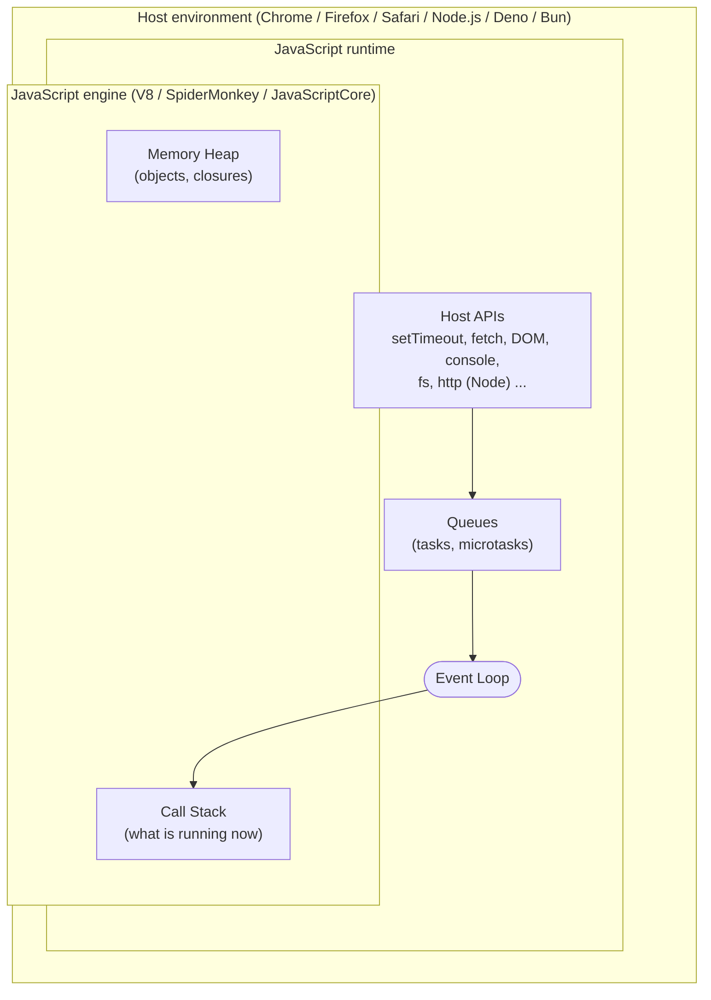

| Layer | What it is | Examples | Provides |
|---|---|---|---|
| **Engine** | Program that parses & executes JS per the **ECMAScript** spec | V8 (Chrome, Edge, Node, Deno), SpiderMonkey (Firefox), JavaScriptCore (Safari, Bun) | Language: `Array`, `Promise`, closures, GC, call stack, heap |
| **Runtime** | Engine **+** host APIs **+** event loop | Browser, Node.js, Deno, Bun | `setTimeout`, `fetch`, `document`, `fs`, the event loop itself |
| **Host** | The program embedding the engine | Chrome tab, Node process | Defines *which* APIs exist and implements the event loop |

> **Important distinction:** `setTimeout`, `fetch`, `document`, and `console` are **NOT part of JavaScript (ECMAScript)**. They are provided by the host. The ECMAScript spec only defines *jobs* (microtasks) and that a host must run them; the **HTML Standard** defines the browser's event loop and task queues. Node.js implements its own loop (libuv).

**Why does it matter?** Because the behaviour you see (ordering, timing, throttling) is defined by the *host*, not by the language. The same code can behave slightly differently in a browser tab vs Node.

---

### Section 2: Inside the Engine (V8)

#### 2.1 From source text to machine code

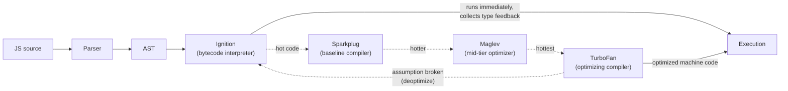

1. **Parse** → source becomes an AST (a lazy pre-parser skips function bodies until they are first called — faster startup).
2. **Ignition** compiles the AST to compact **bytecode** and interprets it right away (start fast, small memory).
3. While running, V8 records **type feedback** ("this `add(a, b)` has only ever seen numbers").
4. **Hot** functions are promoted through faster compilers (**Sparkplug → Maglev → TurboFan** in modern Chrome) that generate optimized machine code *based on those type assumptions*.
5. If an assumption breaks (e.g. `add` suddenly receives a string) the engine **deoptimizes** back to bytecode.

This is **JIT (Just-In-Time) compilation**. Practical takeaway: keep object shapes and argument types consistent in hot paths; don't micro-optimise elsewhere.

#### 2.2 Memory: the heap and the stack

| | **Call stack** | **Memory heap** |
|---|---|---|
| Stores | Execution frames, local primitives, references | Objects, arrays, functions, closures |
| Structure | Ordered LIFO stack | Unstructured pool |
| Size | Small, fixed limit (≈ 10k+ frames; varies by engine) | Large, grows as needed |
| Cleaned by | Popping a frame (automatic) | **Garbage collector** |

#### 2.3 Garbage collection (GC) in one minute

- JS uses **automatic memory management**. An object is garbage when it is **unreachable** from any *root* (global object, current stack, active closures…).
- Engines use **mark-and-sweep** (not reference counting, so circular references are fine): *mark* everything reachable from roots → *sweep* the rest.
- V8 is **generational**: new objects go to a small **young generation** (collected often, very fast — "scavenge"); survivors move to the **old generation** (collected less often, mostly **incremental / concurrent / parallel** to avoid long pauses).
- GC can still cause **jank** if it allocates/frees huge amounts. A **memory leak** is *reachable but no longer needed* memory — the GC can't help because it's technically still reachable (forgotten listeners, timers, caches, detached DOM nodes, closures). *(Dedicated topic later: "Memory Leaks in Frontend Apps".)*

---

### Section 3: Execution Context & the Call Stack

#### 3.1 Execution context

Every time JS runs code it creates an **execution context** — the environment holding the variables, `this`, and the **scope chain** (reference to the outer environment — the mechanism behind **closures**).

| Type | Created when | Count |
|---|---|---|
| **Global** | Script starts | 1 per realm (window / worker) |
| **Function** | A function is **called** | One per call |
| **Eval** | `eval()` runs | Avoid it |

Each context has two phases:

1. **Creation phase** — scope is set up, **declarations are hoisted** (`var` → `undefined`, function declarations → fully available, `let`/`const`/`class` → hoisted but in the **Temporal Dead Zone** until their line runs), `this` is bound.
2. **Execution phase** — code runs line by line, values are assigned.

#### 3.2 The call stack

The **call stack** is a LIFO stack of execution contexts ("frames"). Calling a function **pushes** a frame; returning **pops** it. **Only the code on top of the stack runs.**

```javascript
function multiply(a, b) { return a * b; }
function square(n)      { return multiply(n, n); }
function printSquare(n) { console.log(square(n)); }

printSquare(4);
```

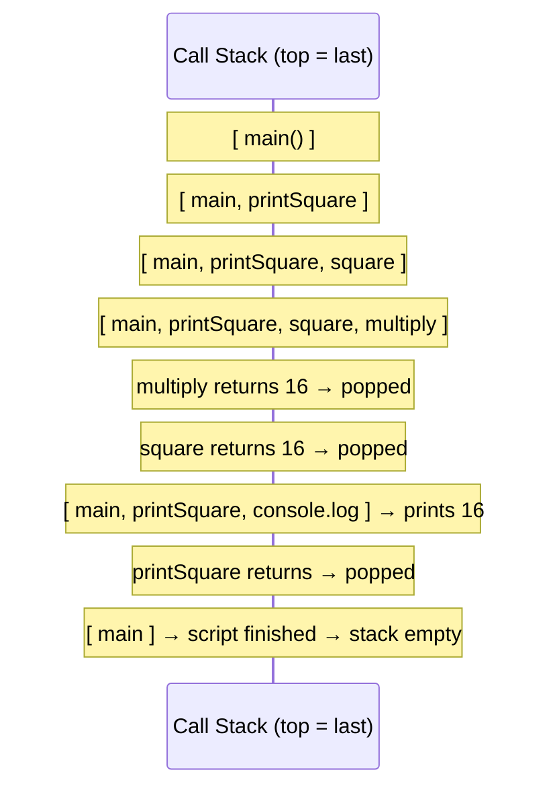

#### 3.3 Run-to-completion

> **A function that is running cannot be interrupted by another piece of JS** (no pre-emption on the same thread). Once a task starts, it runs **until the stack is empty**. This is called **run-to-completion**.

Pros: no data races on the main thread, no locks, easy mental model.
Cons: **a long-running function blocks everything** — rendering, clicks, timers.

#### 3.4 Stack overflow

The stack is finite. Unbounded recursion fills it:

```javascript
function recurse() { recurse(); }
recurse();  // RangeError: Maximum call stack size exceeded
```

Fix: add a base case, convert to a loop, or (for huge workloads) break it into asynchronous chunks (Section 10). Note: `Promise`/`setTimeout`-based recursion does **not** overflow the stack because each callback starts with a fresh, empty stack.

---

### Section 4: Web APIs — Who Really Does the Async Work

JavaScript can't wait. Anything slow — timers, network, disk, user input — is **delegated to the host**, which runs it **outside the JS thread** (other browser threads/processes: network service, timer thread, compositor, etc.). When the work is done, the host **queues a callback** for the event loop.

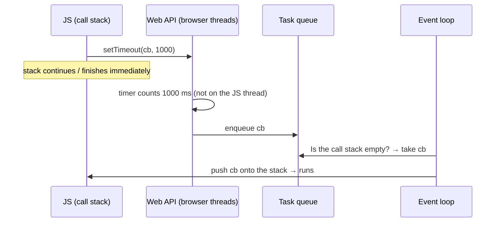

| Capability | Provided by | Result is delivered as |
|---|---|---|
| `setTimeout` / `setInterval` | Timers (host) | **Task** |
| DOM events (`click`, `input`, `scroll`…) | Browser UI / input thread | **Task** |
| `fetch` / `XMLHttpRequest` | Network service | Promise settles → **microtask** (the network *event* itself is a task) |
| `postMessage` / `MessageChannel` | Messaging | **Task** |
| `IndexedDB`, `FileReader` | Storage / IO | **Task** |
| `requestAnimationFrame` | Rendering pipeline | Callback in the **render step** (not a normal task) |
| `queueMicrotask`, `Promise.then` | *The engine itself* | **Microtask** |

> Important: `Promise` handlers are scheduled by the **engine** (ECMAScript jobs). Timers/network are scheduled by the **host**. That is exactly why they use different queues with different priorities.

---

### Section 5: The Queues — Tasks, Microtasks and Friends

#### 5.1 Task queue ("macrotask" queue)

- A **task** is a unit of work the event loop picks up: running a script, a timer callback, an event handler, a `postMessage` handler, parsing chunks of HTML…
- The HTML spec doesn't have *one* queue; it has **many task queues, one per "task source"** (timers, DOM manipulation, user interaction, networking, …). The browser may **prioritise** sources — e.g. user-input tasks are favoured so the page stays responsive. Within one source, ordering is **FIFO**.
- "**Macrotask**" is community jargon (the spec just says *task*), used to contrast with microtasks.

#### 5.2 Microtask queue

- Holds **very short follow-up work** that must run *right after the current script/callback finishes*, before the browser does anything else.
- Sources: **`Promise.then / catch / finally`**, **`await` continuations**, **`queueMicrotask()`**, **`MutationObserver`** callbacks.
- There is **one** microtask queue per event loop (agent), strictly FIFO.
- **Rule:** when the call stack becomes empty, the engine performs a **microtask checkpoint** — it runs **every** microtask, **including new ones queued while draining**, until the queue is empty.

#### 5.3 Other "queues" tied to rendering

| Mechanism | When it runs |
|---|---|
| `requestAnimationFrame(cb)` | Right **before** the next style/layout/paint, once per frame |
| `requestIdleCallback(cb)` | When the loop is idle (after the frame work) — may never run on a busy page; **not supported in Safari** |
| `ResizeObserver` / `IntersectionObserver` | During the rendering step (observers are delivered around layout/paint) |

#### 5.4 Priority at a glance

```
Currently running JS (call stack)           ← always finishes first
        ↓
ALL microtasks (drained completely)         ← VIP
        ↓
Rendering opportunity? (rAF → style → layout → paint)   ← only if the browser decides to render
        ↓
ONE task from a task queue                  ← next iteration
        ↓
(repeat forever)
```

---

### Section 6: The Event Loop Algorithm

The event loop is simply a **`while(true)`** the host runs on each thread. Simplified from the [HTML Standard's processing model](https://html.spec.whatwg.org/multipage/webappapis.html#event-loop-processing-model):

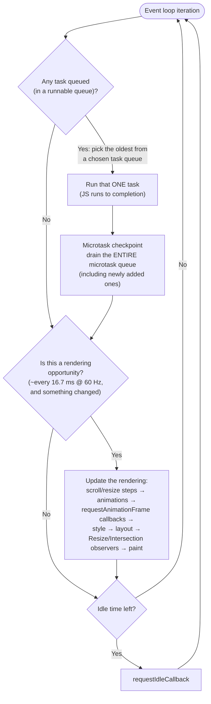

In pseudocode:

```javascript
while (true) {
  const task = pickNextTask();         // from one of the task queues
  if (task) run(task);                 // run-to-completion on the call stack

  runAllMicrotasks();                  // until the microtask queue is EMPTY

  if (isRenderingOpportunity()) {
    runAnimationFrameCallbacks();      // rAF
    recalcStyle(); layout(); paint();  // may be skipped if nothing changed
  }

  if (hasIdleTime()) runIdleCallbacks();
}
```

#### Worked trace

```javascript
console.log('1 sync');
setTimeout(() => console.log('2 timeout'), 0);
Promise.resolve().then(() => console.log('3 promise'));
queueMicrotask(() => console.log('4 microtask'));
(async () => { console.log('5 async start'); await null; console.log('6 after await'); })();
console.log('7 sync end');
```

**Output** *(verified in Node 24; identical in browsers):*

```
1 sync
5 async start
7 sync end
3 promise
4 microtask
6 after await
2 timeout
```

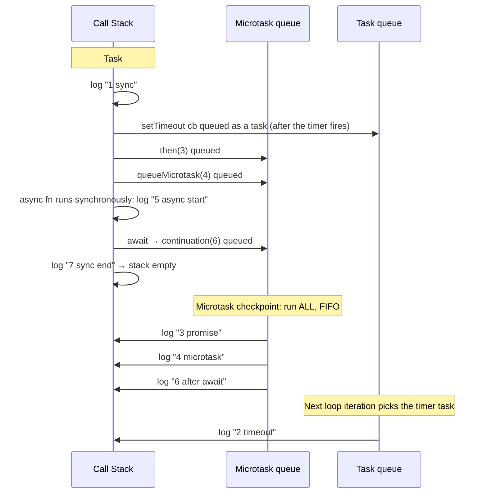

**Why?** The script itself is task #1. It finishes (stack empty) → the microtask queue is drained (3, 4, 6) → *only then* does the loop pick the next task (the timer). That is the single most important rule: **microtasks beat tasks, even a 0 ms timer.**

---

### Section 7: Promises & async/await Under the Hood

#### 7.1 Promise states

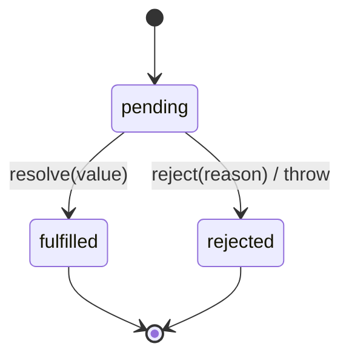

- A promise settles **once** and is then immutable.
- The **executor** function (`new Promise(executor)`) runs **synchronously**. Only the `.then/.catch/.finally` **callbacks** are asynchronous (always microtasks — even on an already-resolved promise).

```javascript
console.log('a');
new Promise(resolve => { console.log('b (executor is sync)'); resolve(); })
  .then(() => console.log('d (then is async)'));
console.log('c');
// a, b (executor is sync), c, d (then is async)
```

#### 7.2 `async/await` is syntax over promises + microtasks

```javascript
async function load() {
  console.log('before');
  const data = await fetchData();   // ← function pauses here, returns a promise to the caller
  console.log('after', data);       // ← continuation runs later as a MICROTASK
}
```

Roughly equivalent to:

```javascript
function load() {
  console.log('before');
  return fetchData().then(data => { console.log('after', data); });
}
```

Rules to remember:

1. Code **before the first `await`** runs **synchronously**.
2. `await x` always yields — even if `x` is not a promise (`await 5` ≈ `Promise.resolve(5).then(...)`).
3. Awaiting an **already native promise** costs **1 microtask tick** (V8 ≥ 7.2). Awaiting a **thenable** or returning a promise from an `async` function costs extra ticks — don't rely on exact tick counts across engines.
4. An `async` function **always returns a promise**; a `throw` becomes a rejection.

#### 7.3 Ordering puzzle (classic interview question)

```javascript
async function a1() { console.log('a1 start'); await a2(); console.log('a1 end'); }
async function a2() { console.log('a2'); }

console.log('script start');
setTimeout(() => console.log('setTimeout'), 0);
a1();
new Promise(res => { console.log('promise executor'); res(); })
  .then(() => console.log('promise then'));
console.log('script end');
```

**Output:**

```
script start
a1 start
a2
promise executor
script end
a1 end          ← microtask queued FIRST (at the await)
promise then    ← microtask queued second
setTimeout      ← task: runs only after all microtasks
```

#### 7.4 Microtask starvation

Because the checkpoint drains the queue **until empty**, a microtask that keeps scheduling microtasks **never lets the loop reach rendering or the next task**:

```javascript
// ❌ Freezes the tab — rendering & input never get a turn
function spin() { queueMicrotask(spin); }
spin();

// ✅ Same "infinite" loop but each iteration is a TASK → browser can render/handle input between them
function spin2() { setTimeout(spin2, 0); }
spin2();
```

#### 7.5 Error handling rules

- A rejected promise with **no handler** triggers the global `unhandledrejection` event (Node: process-level warning/crash on modern versions). Always `.catch()` or `try/await/catch`.
- `try/catch` only catches **synchronous** errors **and** `await`ed rejections — it does **not** catch an error thrown inside a `setTimeout` callback or an un-awaited promise.

```javascript
// ❌ catch never runs — the callback executes in a later task, outside this try block
try { setTimeout(() => { throw new Error('boom'); }, 0); } catch (e) { /* never reached */ }

// ✅ error handling lives inside the async boundary
setTimeout(() => { try { risky(); } catch (e) { report(e); } }, 0);
```

#### 7.6 Combinators

| API | Resolves when | Rejects when | Use for |
|---|---|---|---|
| `Promise.all([...])` | **All** fulfil | **Any** rejects (fail-fast) | Parallel requests that are all required |
| `Promise.allSettled([...])` | All settle | Never | "Run all, report each outcome" |
| `Promise.race([...])` | First **settles** | First rejects | Timeouts |
| `Promise.any([...])` | First **fulfils** | All reject (`AggregateError`) | Fastest mirror / fallback |

```javascript
// ❌ Sequential — takes t1 + t2
const a = await getA();
const b = await getB();

// ✅ Concurrent — takes max(t1, t2)
const [a2, b2] = await Promise.all([getA(), getB()]);
```

---

### Section 8: Timers — Why `setTimeout(fn, 0)` Is Not Zero

`setTimeout(fn, delay)` means "queue `fn` as a task **no sooner than** `delay` ms from now" — a **minimum**, never a guarantee. The task still has to **wait for the call stack to be empty** and for earlier tasks.

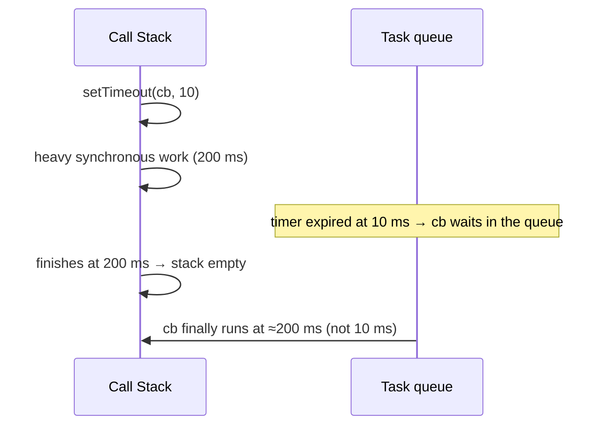

Real-world reasons timers run late:

| Cause | Detail |
|---|---|
| **Busy main thread** | Long task in progress → callback waits |
| **Nesting clamp** | After **5 nested** `setTimeout`/`setInterval` calls, browsers enforce a **≥ 4 ms** minimum delay (HTML spec) |
| **Background-tab throttling** | Hidden tabs: timers are throttled to roughly **once per second**; Chrome applies *intensive throttling* (about once per minute) to long-hidden pages with chained timers |
| **Energy saving / low-power mode** | Browsers may coalesce timers |
| **Clamped by integer overflow** | Delays above ~24.8 days (2³¹−1 ms) fire immediately |

**`setInterval` pitfalls:** it does not wait for your callback to finish, so a slow callback can cause **overlapping/back-to-back runs** and **drift**. Prefer **recursive `setTimeout`** when each run depends on the previous one finishing:

```javascript
// ✅ Next run is scheduled only AFTER the current one completes
async function poll() {
  try { await refresh(); } finally { setTimeout(poll, 5000); }
}
poll();
```

For animation use **`requestAnimationFrame`**, not timers (Section 9). For timing measurement use `performance.now()` (monotonic, sub-ms), not `Date.now()`.

---

### Section 9: The Event Loop and Rendering

Rendering happens **on the same main thread** as your JS. The browser only gets to repaint **between tasks**. If JS holds the thread, the screen cannot update.

#### 9.1 Anatomy of a ~16.7 ms frame (60 Hz)

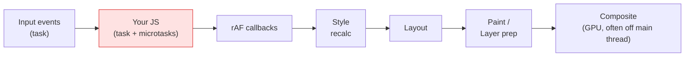

```
|<-------------------- 16.7 ms budget (60 fps) -------------------->|
|  JS (≤ ~10 ms) | Style | Layout | Paint | Composite (GPU) |
```

- The browser aims to render once per display refresh (60/90/120/144 Hz). If a task overruns, **frames are dropped** → jank.
- Browsers **skip** the rendering step if nothing visual changed or the tab is hidden.
- Browser work (style, layout, paint prep) also needs time in the frame, so your own JS budget is **less than 16 ms** — roughly **≤ 10 ms** is a safe target.

#### 9.2 `requestAnimationFrame` (rAF)

- Runs your callback **just before the next paint** — once per frame, paused in hidden tabs.
- Ideal place for **DOM writes that drive visuals/animation**.

```javascript
// ❌ Timer isn't aligned to frames → wasted work, jank, runs in background tabs
setInterval(() => { box.style.left = x++ + 'px'; }, 16);

// ✅ Synced to the display's refresh
function frame() { box.style.left = x++ + 'px'; requestAnimationFrame(frame); }
requestAnimationFrame(frame);
```

#### 9.3 Layout thrashing (forced synchronous layout)

Reading layout (`offsetHeight`, `getBoundingClientRect()`) right after writing styles forces the browser to **recalculate layout immediately**, inside your task. Do it in a loop and you pay that cost per iteration.

```javascript
// ❌ write → read → write → read … forces layout N times
items.forEach(el => { el.style.width = el.parentNode.offsetWidth / 2 + 'px'; });

// ✅ batch: read everything first, then write everything
const widths = items.map(el => el.parentNode.offsetWidth);
items.forEach((el, i) => { el.style.width = widths[i] / 2 + 'px'; });
```

#### 9.4 Microtask vs rAF vs task — where does my code land?

```
user clicks → [event handler = TASK] → microtasks → (maybe) rAF → style/layout/paint → next TASK (timer) → ...

button.onclick = () => {
  setTimeout(() => console.log('timeout'), 0);          // next task  — AFTER paint is possible
  requestAnimationFrame(() => console.log('rAF'));      // before the next paint
  Promise.resolve().then(() => console.log('micro'));   // right after the handler
};
// order: micro → rAF → timeout   (timeout vs rAF can vary by browser/timing; micro is always first)
```

> A `setTimeout(0)` callback is **not guaranteed to run before or after** the next paint. If you need "after layout/paint", use **double rAF** or `requestAnimationFrame` + `setTimeout`/`MessageChannel`.

---

### Section 10: Blocking the Main Thread (and How to Stop)

#### 10.1 The problem

```javascript
button.addEventListener('click', () => {
  const start = performance.now();
  while (performance.now() - start < 3000) {} // 3 s of synchronous work
  // UI frozen: no repaint, no clicks, no scroll, timers delayed
});
```

A **long task** is any task running **> 50 ms** (the standard threshold; Long Tasks API / Lighthouse's TBT use it). Long tasks directly hurt **INP** (Interaction to Next Paint, a Core Web Vital — good ≤ 200 ms), because an input that arrives mid-task has to wait for it to finish.

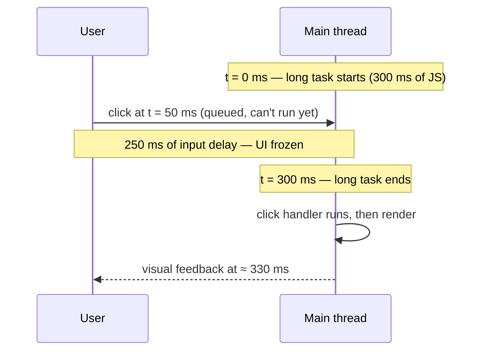

#### 10.2 Strategies, from cheapest to most powerful

| # | Strategy | How | Best for |
|---|---|---|---|
| 1 | **Do less** | Memoise, cache, virtualize lists, avoid re-renders, debounce | Always the first answer |
| 2 | **Yield to the main thread** | `await scheduler.yield()` / `setTimeout` chunking | Long loops you must keep on the main thread |
| 3 | **Prioritised scheduling** | `scheduler.postTask(fn, { priority })` | Background vs user-blocking work |
| 4 | **Idle time** | `requestIdleCallback` | Non-urgent work (analytics, prefetch) |
| 5 | **Move off-thread** | **Web Worker** / `OffscreenCanvas` / WebAssembly in a worker | CPU-heavy computation (parsing, crypto, image processing) |

#### 10.3 Chunking with a yield helper

```javascript
// Yield: let the browser handle input + rendering, then continue.
// scheduler.yield() (Chromium) keeps your continuation at HIGH priority; fall back to a timer elsewhere.
const yieldToMain = () =>
  globalThis.scheduler?.yield
    ? scheduler.yield()
    : new Promise(resolve => setTimeout(resolve, 0));

async function processAll(items) {
  let sliceEnd = performance.now() + 16;       // ~1 frame budget per slice
  for (const item of items) {
    heavyWork(item);
    if (performance.now() >= sliceEnd) {       // time's up → give the loop back
      await yieldToMain();
      sliceEnd = performance.now() + 16;
    }
  }
}
```

> Why `setTimeout` and not `await Promise.resolve()` to yield? A promise yield is a **microtask** — it does **not** let the browser render or process input (Section 7.4). To truly yield you must create a **new task**.
>
> `scheduler.yield()` is Chromium-only at the time of writing — always **feature-detect with a fallback** (check [MDN compat](https://developer.mozilla.org/en-US/docs/Web/API/Scheduler/yield)).

#### 10.4 `requestIdleCallback`

```javascript
function work(deadline) {
  while (deadline.timeRemaining() > 0 && queue.length) doSmallJob(queue.shift());
  if (queue.length) requestIdleCallback(work, { timeout: 2000 }); // keep going next idle period
}
// timeout: guarantee it runs within 2 s even if the page is never idle
requestIdleCallback(work, { timeout: 2000 });
```

> Not available in Safari — use a `setTimeout` fallback. Never touch the DOM heavily inside idle callbacks (it can force layout at a bad time).

---

### Section 11: Web Workers — More Threads, More Event Loops

JS is single-threaded **per agent**, but a page can create more agents:

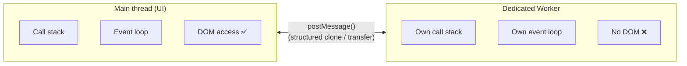

- Each worker has its **own heap, call stack and event loop** — **no shared mutable state** by default, so no data races.
- Communication is via **messages** (`postMessage`) — data is **copied** (structured clone) or **transferred** (`ArrayBuffer`, `OffscreenCanvas`, ports — zero-copy). `SharedArrayBuffer` + `Atomics` enables true shared memory (requires cross-origin isolation headers).
- Workers **cannot touch the DOM**.
- Types: **Dedicated** (one owner), **Shared** (multiple tabs, same origin), **Service Worker** (network proxy / offline — separate topic).

```javascript
// main.js
const worker = new Worker(new URL('./sum.worker.js', import.meta.url), { type: 'module' });
worker.postMessage({ numbers: hugeArray });
worker.onmessage = (e) => console.log('sum =', e.data);   // UI stayed responsive

// sum.worker.js
self.onmessage = (e) => {
  const total = e.data.numbers.reduce((a, b) => a + b, 0);
  self.postMessage(total);
};
```

> **Rule of thumb:** Worker when the computation is CPU-bound and takes **> ~50 ms**; chunking when it must touch the DOM. *(Deep dive: Phase 1 topic 12 & Phase 4 topic 51.)*

---

### Section 12: Node.js Event Loop (libuv) vs Browser

Node uses V8 (the engine) + **libuv** (a C library providing the event loop, thread pool and async I/O). The loop has **explicit phases**:

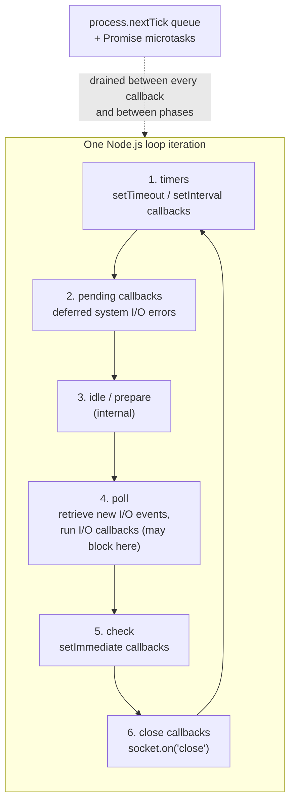

| Feature | Browser | Node.js |
|---|---|---|
| Loop implementation | HTML Standard (per-agent, many task sources) | libuv, **6 phases** |
| Microtasks | After each task | After each callback (Node ≥ 11, same as browser) |
| Extra queue | — | **`process.nextTick`** — runs **before** Promise microtasks |
| "Run after this I/O" | — | **`setImmediate`** (check phase) |
| Rendering step | Yes (rAF, paint) | No UI |
| Heavy work | Web Workers | `worker_threads`, `child_process`, **libuv thread pool** (4 threads by default) for fs, DNS, crypto, zlib |

```javascript
// Verified on Node 24
const fs = require('fs');
setTimeout(() => console.log('timeout'), 0);
setImmediate(() => console.log('immediate'));
process.nextTick(() => console.log('nextTick'));
Promise.resolve().then(() => console.log('promise'));
console.log('sync');

fs.readFile(__filename, () => {
  setTimeout(() => console.log('io: timeout'), 0);
  setImmediate(() => console.log('io: immediate'));
});
```

```
sync
nextTick       ← nextTick queue first…
promise        ← …then Promise microtasks
timeout        ← from the main module this order is NOT guaranteed (depends on process speed)
immediate
io: immediate  ← inside an I/O callback, setImmediate ALWAYS beats setTimeout
io: timeout
```

> **Gotcha:** `process.nextTick` recursion starves I/O just like microtask recursion starves rendering. Prefer `queueMicrotask` / `setImmediate` unless you specifically need nextTick semantics.
> Node.js docs also note that **`fs.readFile` etc. run on the thread pool** — "async" there means *other OS threads*, not magic.

---

### Section 13: Event Loop in React & Frameworks

Frameworks are built **on top of** the event loop — understanding it explains their behaviour:

| Behaviour | Event-loop explanation |
|---|---|
| **`setState` is "async"** / batching (React 18: automatic batching everywhere) | Updates inside one event handler/task are collected and rendered once after the handler finishes — not one render per call |
| **`useEffect` runs after paint** (usually) | Passive effects are scheduled as a later task so the browser can paint first. `useLayoutEffect` runs synchronously *before* paint |
| **Concurrent rendering / `startTransition`** | React renders in **small slices** and **yields** to the browser between them (its `scheduler` package uses `MessageChannel` — a macrotask — in browsers) so typing/clicks stay responsive |
| **Vue `nextTick`** | Runs your callback after the DOM update flush, implemented with a Promise microtask |
| **Why `await` inside a `useEffect` callback needs a wrapper** | Effect callbacks must return nothing/cleanup, not a Promise — define an inner `async` function |
| **Stale closures** | A callback created in an old render captures *old* variables; with timers/async this shows up as "why is my state old inside `setTimeout`?" |

```javascript
// Typical React 18 behaviour
function Counter() {
  const [n, setN] = useState(0);
  const onClick = () => {
    setN(n + 1);
    setN(n + 1);          // still based on the same n → final n = 1 (batched)
    console.log(n);       // logs the OLD value — the render hasn't happened yet
    setTimeout(() => console.log(n), 1000);  // also the OLD value (closure over this render's n)
  };
}
// Use the updater form for chained updates: setN(prev => prev + 1)
```

---

### Section 14: Debugging & Measuring

| Tool | What it shows |
|---|---|
| **Chrome DevTools → Performance** | Main-thread flame chart; red-flagged **Long tasks** (> 50 ms); each task's JS, style, layout, paint; **Interactions** track (INP) |
| **Chrome DevTools → Sources/Debugger** | **Call Stack** panel and **async stack traces** (shows the `await` chain) |
| **`console.trace()`** | Prints the current call stack |
| **Long Tasks API / `PerformanceObserver`** | Detect long tasks in production (RUM) |
| **Long Animation Frames (LoAF) API** | Better attribution than Long Tasks — shows *which script* delayed a frame (Chromium) |
| **web-vitals library** | Field INP / LCP / CLS |
| **[Loupe](http://latentflip.com/loupe)** | Visualiser — watch a stack, Web APIs and queues animate (great for learning) |

```javascript
// Detect long tasks in the field
new PerformanceObserver((list) => {
  for (const entry of list.getEntries()) {
    console.warn(`Long task: ${Math.round(entry.duration)} ms`, entry);
  }
}).observe({ type: 'longtask', buffered: true });
```

---

## Real-World Examples

**Example 1 — Keep the UI alive while processing a big list:**
```javascript
// ❌ BAD: 50 000 items in one task → UI frozen for seconds
function renderAll(rows) { rows.forEach(r => table.append(buildRow(r))); }

// ✅ GOOD: render in slices, yield between them (see Section 10.3), and use a fragment per slice
async function renderChunked(rows, size = 500) {
  for (let i = 0; i < rows.length; i += size) {
    const frag = document.createDocumentFragment();
    rows.slice(i, i + size).forEach(r => frag.append(buildRow(r)));
    table.append(frag);
    await yieldToMain();
  }
}
// ✅ BEST for huge lists: virtual scrolling (render only what's visible)
```

**Example 2 — Debounce input so you don't flood the queue:**
```javascript
function debounce(fn, ms = 300) {
  let id;
  return (...args) => { clearTimeout(id); id = setTimeout(() => fn(...args), ms); };
}
search.addEventListener('input', debounce(e => fetchResults(e.target.value), 300));
```

**Example 3 — Race condition: out-of-order responses (async ≠ ordered):**
```javascript
// ❌ BAD: a slow response for "ab" can arrive AFTER the response for "abc" and overwrite it
input.oninput = async (e) => { render(await search(e.target.value)); };

// ✅ GOOD: cancel the stale request with AbortController
let controller;
input.oninput = async (e) => {
  controller?.abort();
  controller = new AbortController();
  try {
    render(await search(e.target.value, { signal: controller.signal }));
  } catch (err) {
    if (err.name !== 'AbortError') throw err;   // aborted = expected, ignore
  }
};
```

**Example 3b — Classic closure-in-loop trap (`var` vs `let`)** *(verified):*
```javascript
for (var i = 0; i < 3; i++) setTimeout(() => console.log('var', i), 0); // var 3, var 3, var 3
for (let j = 0; j < 3; j++) setTimeout(() => console.log('let', j), 0); // let 0, let 1, let 2
// The callbacks run AFTER the loop finishes. `var` shares ONE binding (value 3);
// `let` creates a fresh binding per iteration.
```

**Example 4 — Timeout for a fetch with `Promise.race` (and why `AbortSignal.timeout` is better):**
```javascript
// ✅ Modern: actually cancels the network request
const res = await fetch(url, { signal: AbortSignal.timeout(5000) });

// Promise.race only stops WAITING — the request keeps running in the background
const timeout = new Promise((_, rej) => setTimeout(() => rej(new Error('timeout')), 5000));
const res2 = await Promise.race([fetch(url), timeout]);
```

**Example 5 — Offload heavy work to a Worker instead of freezing the UI:** see Section 11.

---

## Key Points Summary

| Concept | One-Line Explanation |
|---|---|
| **JS engine** | Parses/compiles/runs ECMAScript (V8, SpiderMonkey, JSC) — has a heap + call stack |
| **JS runtime** | Engine + host APIs + queues + event loop |
| **Single-threaded** | One call stack per agent — one thing runs at a time |
| **Call stack** | LIFO stack of execution contexts; only the top runs |
| **Run-to-completion** | A running task is never interrupted by other JS |
| **Web APIs** | Host-provided features (timers, fetch, DOM) that work *off* the JS thread |
| **Task (macrotask)** | Unit picked by the loop: timers, events, `postMessage`, I/O |
| **Microtask** | Promise callbacks, `await`, `queueMicrotask`, `MutationObserver` — drained fully after every task |
| **Event loop** | Picks one task → drains microtasks → maybe renders → repeats |
| **Rendering** | Happens between tasks; rAF runs right before paint |
| **`setTimeout(0)`** | "As soon as possible *after* the stack is empty & microtasks are done" — min ~1–4 ms |
| **Long task** | Any task > 50 ms → input delay, jank, bad INP |
| **Yield** | Create a *new task* (`setTimeout`, `scheduler.yield`) so the browser can render/handle input |
| **Web Worker** | Separate thread + event loop; talk via `postMessage`; no DOM |
| **`process.nextTick`** | Node-only queue that runs before Promise microtasks |
| **libuv** | Node's event loop + thread pool (6 phases) |
| **Microtask starvation** | A microtask that keeps queuing microtasks blocks rendering forever |

---

## Test Your Understanding

**Q1 (Basic):**
Is JavaScript asynchronous? Is it multi-threaded? Explain precisely.

<details>
<summary>Answer</summary>

The **language executes synchronously on a single thread** (one call stack per agent). **Asynchrony comes from the host**: the browser (or Node) performs slow work (timers, network, I/O) **outside** the JS thread and, when done, queues a callback that the **event loop** runs once the call stack is empty. So the *runtime* is concurrent, but your JS code is not run in parallel — unless you explicitly start another agent (Web Worker / `worker_threads`), which has its own stack and event loop.
</details>

**Q2 (Basic):**
What is the difference between the call stack, the task queue and the microtask queue?

<details>
<summary>Answer</summary>

- **Call stack:** what is executing *right now* (LIFO).
- **Task queue(s):** callbacks waiting from timers, DOM events, `postMessage`, I/O. The loop takes **one** per iteration.
- **Microtask queue:** Promise reactions, `await` continuations, `queueMicrotask`, `MutationObserver`. **Fully drained** whenever the stack empties — before the next task and before rendering.
</details>

**Q3 (Application):**
What does this print and why?

```javascript
console.log('A');
setTimeout(() => {
  console.log('B');
  Promise.resolve().then(() => console.log('C'));
}, 0);
setTimeout(() => console.log('D'), 0);
Promise.resolve()
  .then(() => { console.log('E'); })
  .then(() => console.log('F'));
console.log('G');
```

<details>
<summary>Answer</summary>

**`A, G, E, F, B, C, D`** *(verified in Node 24)*

1. Sync: `A`, `G`.
2. Stack empty → microtask checkpoint: `E`, and the `F` handler it queued also runs in the same checkpoint → `F`.
3. Next task = first timeout: `B`; it queues a microtask `C`.
4. **Microtasks run after *each* task** → `C` runs **before** the second timeout task.
5. Next task: `D`.

(Key insight: `C` beats `D` even though both timers were queued at the same time — the microtask checkpoint happens between the two timer tasks.)
</details>

**Q4 (Application):**
Predict the output:

```javascript
async function a1() { console.log('a1 start'); await a2(); console.log('a1 end'); }
async function a2() { console.log('a2'); }
console.log('script start');
setTimeout(() => console.log('setTimeout'), 0);
a1();
new Promise(res => { console.log('promise executor'); res(); })
  .then(() => console.log('promise then'));
console.log('script end');
```

<details>
<summary>Answer</summary>

```
script start
a1 start
a2
promise executor
script end
a1 end
promise then
setTimeout
```

`a1()` runs synchronously until its `await`; `a2()` runs synchronously and returns a resolved promise, so the continuation (`a1 end`) is queued as a microtask **before** the `.then(promise then)` callback is registered. Both microtasks run before the timer task.
</details>

**Q5 (Application):**
Your "Export CSV" button freezes the page for 2 s because it processes 200 000 rows. Give three different fixes and when you'd choose each.

<details>
<summary>Answer</summary>

1. **Web Worker** — move the CPU-bound parsing/serialising off the main thread; send back a `Blob`/transferable `ArrayBuffer`. *Best when no DOM access is needed (this case).*
2. **Chunk + yield** — process e.g. 5 000 rows per slice, `await scheduler.yield()` (fallback `setTimeout`) between slices; show a progress bar. *When DOM access/simple code is needed, or workers aren't available.*
3. **Do less / stream** — server-side export, or stream with `ReadableStream`/`TextEncoderStream` so the UI never holds the whole dataset. *When the dataset is really large or the work belongs on the server.*

Don't use `await Promise.resolve()` or `.then()` chaining as a "yield" — that's a microtask and still starves rendering.
</details>

**Q6 (Tricky):**
A microtask schedules another microtask forever. What happens to the page? What if it used `setTimeout` instead?

<details>
<summary>Answer</summary>

**Microtask version:** the microtask queue is never empty, so the checkpoint never completes → the loop **never reaches rendering or the next task**. The tab freezes (no paint, no input, no timers) — **microtask starvation**.

**`setTimeout` version:** each iteration is a separate *task*. Between tasks the browser can run a microtask checkpoint, render, and process input events, so the page stays responsive (though CPU is busy and timers get clamped to ≥ 4 ms after nesting level 5).
</details>

**Q7 (Tricky):**
In which order do the handlers log when the user **physically clicks** the button, versus when your code calls `button.click()`? (Both listeners queue a microtask.)

```javascript
btn.addEventListener('click', () => { Promise.resolve().then(() => console.log('micro 1')); console.log('listener 1'); });
btn.addEventListener('click', () => { Promise.resolve().then(() => console.log('micro 2')); console.log('listener 2'); });
```

<details>
<summary>Answer</summary>

- **Real user click:** the stack is **empty** after each listener returns, so a microtask checkpoint runs **between** listeners → `listener 1, micro 1, listener 2, micro 2`.
- **`btn.click()` from script:** the stack is **not empty** (your script is still running), so microtasks wait until it unwinds → `listener 1, listener 2, micro 1, micro 2`.

(Demonstrated by Jake Archibald in *Tasks, microtasks, queues and schedules*.) Lesson: the microtask checkpoint runs when the **JS stack becomes empty**, not "after every callback".
</details>

**Q8 (Tricky):**
Why does this log `3 3 3` and how do you get `0 1 2` without changing `var`?

```javascript
for (var i = 0; i < 3; i++) setTimeout(() => console.log(i), 0);
```

<details>
<summary>Answer</summary>

The callbacks are tasks that run **after** the loop finishes; `var i` is **one shared binding** (function/global scope) whose final value is `3`. Fixes: use `let` (fresh binding per iteration), or capture the value — an IIFE `((j) => setTimeout(() => console.log(j), 0))(i)` or `setTimeout(console.log, 0, i)` (extra argument).
</details>

**Q9 (Tricky, Node):**
`setTimeout(fn, 0)` and `setImmediate(fn)` are both called from the main module. Which runs first? What if they are called inside an `fs.readFile` callback?

<details>
<summary>Answer</summary>

From the **main module** the order is **non-deterministic** — it depends on whether 1 ms has elapsed when the loop enters the timers phase. Inside an **I/O callback** (poll phase) `setImmediate` is **always first**, because the check phase comes right after poll, while timers wait for the next iteration. And `process.nextTick` / Promise callbacks run before either, in the order: nextTick queue → promise microtasks.
</details>

**Q10 (System design):**
You're building a live search box that also renders a heavy chart on each result. List the event-loop-related design decisions.

<details>
<summary>Answer</summary>

- **Debounce** keystrokes (300 ms) so fewer fetches/tasks are queued.
- **Abort stale requests** (`AbortController`) so out-of-order responses can't overwrite fresh state.
- Keep **the input handler tiny** — update the input synchronously (INP), defer expensive work (`startTransition` / `scheduler.postTask` with `background` priority).
- **Chart rendering**: prefer canvas/`OffscreenCanvas` in a **worker**, or chunk + yield; use `requestAnimationFrame` for DOM writes.
- Measure with **INP/Long Tasks** in the field and confirm no task > 50 ms in the DevTools Performance panel.
</details>

---

## Cheat Sheet

**Key Definitions:**
- **Engine:** executes JS (V8, SpiderMonkey, JSC). **Runtime:** engine + host APIs + event loop.
- **Call stack:** current execution frames (LIFO). **Heap:** object memory (GC-managed).
- **Task (macrotask):** timers, DOM events, `postMessage`, I/O callbacks. One per loop turn.
- **Microtask:** `Promise.then/catch/finally`, `await`, `queueMicrotask`, `MutationObserver`. Drained completely after every task / when the stack empties.
- **Event loop:** stack empty? → run microtasks → render? → next task.
- **Long task:** > 50 ms on the main thread. **INP good:** ≤ 200 ms.

**Quick Reference — execution order:**
```
1. Synchronous code (current stack, incl. Promise executors and code before the first await)
2. process.nextTick queue                       (Node only)
3. ALL microtasks (Promise reactions, await continuations, queueMicrotask)
4. [render step if due]  rAF → style → layout → paint
5. ONE task (setTimeout / event / postMessage / I/O)
6. Go to 3  (microtasks after EVERY task)
```

**Quick Reference — which API for what:**
```
Run right after this code, before anything else .... queueMicrotask / Promise.then
Run in the next loop turn ........................... setTimeout(fn, 0) / MessageChannel
Run before the next paint (visual updates) .......... requestAnimationFrame
Run when the browser is idle ........................ requestIdleCallback (not Safari)
Let the browser breathe inside a long loop .......... await scheduler.yield() || setTimeout
Prioritised background work ......................... scheduler.postTask(fn, {priority:'background'})
CPU-heavy work ...................................... Web Worker
Node: after I/O ..................................... setImmediate
```

**Common Mistakes to Avoid:**

| Mistake | Why Wrong | Fix |
|---|---|---|
| "JS is async by itself" | The *host* does the async work; JS runs one thing at a time | Think: stack + host APIs + queues |
| Expecting `setTimeout(fn, 0)` to run immediately / on time | It's a *minimum*; waits for the stack + microtasks (+ clamping/throttling) | Don't use timers for precise timing; use `performance.now()`/rAF |
| Using `await Promise.resolve()` to "yield to the UI" | Microtask → never lets the browser render | `await scheduler.yield()` or `setTimeout` |
| Long synchronous loops in handlers | Freezes input & paint; bad INP | Chunk, yield, or Worker |
| `await` in sequence for independent requests | Serialises latency | `Promise.all` |
| Not handling promise rejections | `unhandledrejection` / silent failures | `try/await/catch`, `.catch`, global handler |
| `try/catch` around `setTimeout` or un-awaited promise | Error occurs in a later task | Catch inside the callback / `await` it |
| `setInterval` with a slow async callback | Overlaps / drifts | Recursive `setTimeout` after completion |
| Animating with `setInterval` | Not frame-aligned, runs in hidden tabs | `requestAnimationFrame` / CSS animations |
| Read-after-write layout in loops | Forced synchronous layout (thrashing) | Batch reads, then writes |
| `var` in async loops | Shared binding | `let`/`const` |
| Recursive `nextTick`/microtask scheduling | Starves I/O / rendering | Use `setImmediate`/`setTimeout` |
| Assuming exact microtask tick counts across engines | Spec details (thenables, `return promise`) differ in tick cost | Design for correctness, not tick order |
| Blocking Node's loop with sync APIs (`fs.readFileSync`, heavy JSON) in a server | Every request waits | Async APIs, streams, worker threads |

---

## References & Further Reading

**Core docs**
- MDN: [The event loop](https://developer.mozilla.org/en-US/docs/Web/JavaScript/Event_loop)
- MDN: [Using microtasks in JavaScript with `queueMicrotask()`](https://developer.mozilla.org/en-US/docs/Web/API/HTML_DOM_API/Microtask_guide)
- MDN: [`setTimeout` — reasons for delays longer than specified](https://developer.mozilla.org/en-US/docs/Web/API/Window/setTimeout#reasons_for_delays_longer_than_specified)
- MDN: [`requestAnimationFrame`](https://developer.mozilla.org/en-US/docs/Web/API/Window/requestAnimationFrame) · [`requestIdleCallback`](https://developer.mozilla.org/en-US/docs/Web/API/Window/requestIdleCallback) · [`Scheduler.yield()`](https://developer.mozilla.org/en-US/docs/Web/API/Scheduler/yield)
- MDN: [Using Promises](https://developer.mozilla.org/en-US/docs/Web/JavaScript/Guide/Using_promises) · [`async function`](https://developer.mozilla.org/en-US/docs/Web/JavaScript/Reference/Statements/async_function)
- MDN: [Memory management](https://developer.mozilla.org/en-US/docs/Web/JavaScript/Guide/Memory_management)
- MDN: [Using Web Workers](https://developer.mozilla.org/en-US/docs/Web/API/Web_Workers_API/Using_web_workers)

**Performance (web.dev / Chrome)**
- web.dev: [Optimize long tasks](https://web.dev/articles/optimize-long-tasks)
- web.dev: [Interaction to Next Paint (INP)](https://web.dev/articles/inp)
- Chrome for Developers: [Timer throttling in Chrome 88](https://developer.chrome.com/blog/timer-throttling-in-chrome-88)

**Specs**
- WHATWG HTML Standard: [Event loops & processing model](https://html.spec.whatwg.org/multipage/webappapis.html#event-loops)
- ECMAScript: [Jobs and host operations to enqueue jobs](https://tc39.es/ecma262/#sec-jobs)

**Engine internals (V8)**
- [Launching Ignition and TurboFan](https://v8.dev/blog/launching-ignition-and-turbofan) · [Sparkplug](https://v8.dev/blog/sparkplug) · [Maglev](https://v8.dev/blog/maglev)
- [Trash talk: the Orinoco garbage collector](https://v8.dev/blog/trash-talk)
- [Faster async functions and promises](https://v8.dev/blog/fast-async)

**Node.js**
- Node.js docs: [The Node.js Event Loop, Timers, and `process.nextTick()`](https://nodejs.org/en/learn/asynchronous-work/event-loop-timers-and-nexttick)
- libuv: [Design overview](https://docs.libuv.org/en/v1.x/design.html)

**Deep dives & talks**
- Jake Archibald: [Tasks, microtasks, queues and schedules](https://jakearchibald.com/2015/tasks-microtasks-queues-and-schedules/) — *the* must-read
- Jake Archibald: [In The Loop (JSConf.Asia 2018)](https://www.youtube.com/watch?v=cCOL7MC4Pl0)
- Philip Roberts: [What the heck is the event loop anyway? (JSConf EU 2014)](https://www.youtube.com/watch?v=8aGhZQkoFbQ) · visualiser: [Loupe](http://latentflip.com/loupe)
- React: [`scheduler` package source](https://github.com/facebook/react/tree/main/packages/scheduler)

---

> **Previous Topic:** [Browser Storage Mechanisms](./browser-storage-mechanisms.md)
> — Where and how the browser stores data on the client

> **Next Topic:** DOM & Virtual DOM *(coming soon)*
> — What the tree your JS manipulates really is, and why frameworks wrap it

*Saved on: 2026-10-08 | Repo: Frontend System Design Learning Notes*
